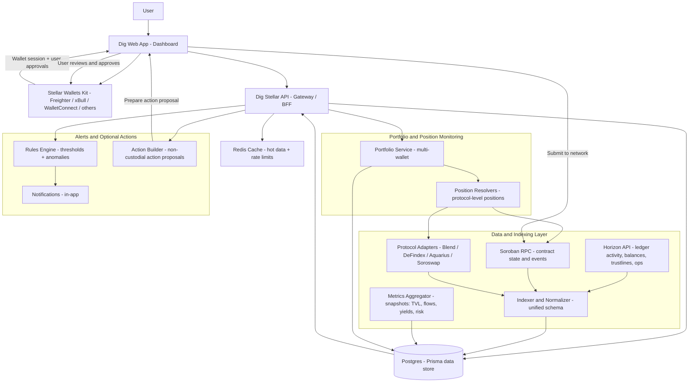
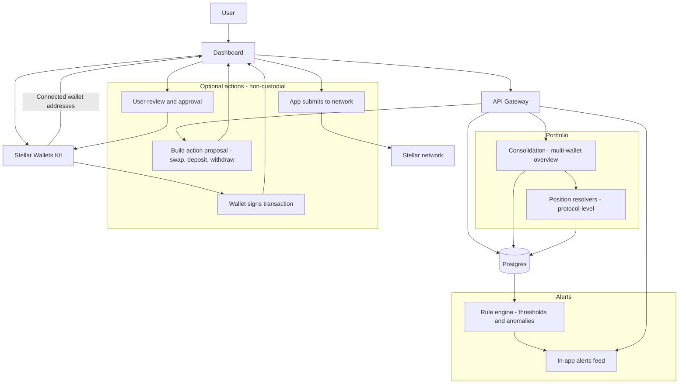

# Dig Stellar — Technical Architecture

This document is the single source of truth for the technical architecture of Dig’s Stellar module. It explains how we collect data, compute analytics, support multi-wallet portfolio monitoring, generate alerts, and enable optional non-custodial actions.

---

## 1. Objectives

Dig Stellar aims to increase ecosystem visibility and user effectiveness across Stellar DeFi by delivering:

- Protocol analytics and comparisons across integrated DeFi protocols
- Multi-wallet portfolio monitoring with consolidated exposure
- In-app alerting based on on-chain activity and metric deltas
- Optional non-custodial action proposals that users approve and sign in their wallet

---

## 2. Core Design Principles

- Protocol-first indexing: focus on the integrated DeFi protocols rather than full-chain indexing
- Near real-time snapshots: metrics are stored as time-windowed snapshots on a predictable cadence
- Modular adapter layer: integrate protocols via dedicated adapters and normalize to a unified schema
- Non-custodial execution: Dig never holds keys; users sign in-wallet
- Multi-wallet is explicit: one connected wallet plus optional user-added watch addresses

---

## 3. High-level System Architecture



---

## 4. Wallet Integration and User Connection Model

### 4.1 Multi-provider wallet connectivity

Dig uses Stellar Wallets Kit as the frontend integration layer to connect Stellar wallet providers (e.g., Freighter, xBull, WalletConnect, Albedo) and request user approvals/signatures. Wallet access remains fully non-custodial: Dig never receives private keys and signatures are always performed in-wallet.

### 4.2 User profile and stored configuration

Dig stores only non-sensitive configuration:
	•	tracked wallet addresses selected by the user
	•	labels and grouping preferences
	•	alert preferences and thresholds
	•	current session context (which address is the active signer)

---

## 5. Multi-Wallet Portfolio and Signing Experience

### 5.1 Tracked addresses and active signer

To maximize accessibility and time savings, Dig provides a single portfolio view across multiple wallet addresses. Users can add multiple Stellar addresses to track balances, DeFi positions, rewards, and alerts in one place.

At any time, one address is the active signer: the wallet currently connected through Stellar Wallets Kit in the session. Any tracked address can be used for execution by switching the active signer to that address when needed.

### 5.2 Signing from different wallets

Dig enables execution from multiple wallets through a simple, explicit signer model. Each action proposal is tied to a single source address. When a user initiates an action from the portfolio:
	•	If the source address is already the active signer, Dig returns an action proposal and the user signs in their wallet via Stellar Wallets Kit.
	•	If another tracked address is selected, the UI guides the user through a quick signer switch by opening the provider connection flow for that address, then replays the same action proposal for signature and submission.

This approach keeps execution fully non-custodial and user-controlled while offering a smooth multi-wallet experience.

### 5.3 UX guidance for signer switching

The UI always shows the current signer and provides a one-step “Switch signer” flow when required. Users can track multiple addresses in one dashboard and execute actions from any of them by connecting the relevant wallet for the action.

## 6. Signature and Execution Model

### 6.1 Action proposals
Dig provides guided action proposals for supported protocols, such as swap, deposit, withdraw, and lending interactions where supported. Each proposal is scoped to:
- a single source address (the signer)
- a target protocol and venue
- a clear user-facing summary of the expected effect

Proposals are built from the latest indexed state (snapshots plus relevant on-chain reads). Where supported, Dig may use Soroban simulation to preview expected outcomes and reduce execution errors before presenting the proposal to the user.

### 6.2 Signer selection and multi-wallet execution
Dig supports execution from multiple wallets through an active signer model:
- the user selects the source address for an action from their tracked addresses
- if the source address matches the current active signer, the user can sign immediately via Stellar Wallets Kit
- if another source address is selected, the UI guides the user through a signer switch by connecting the wallet that controls that address, then continues with the same proposal flow

This design keeps execution fully non-custodial and user-controlled while enabling a smooth multi-wallet experience.

### 6.3 End-to-end execution flow
1. User selects an action and a source address  
2. Dig API returns an action proposal (summary plus transaction proposal)  
3. The UI requests approval and signature via Stellar Wallets Kit  
4. The UI submits the signed transaction to the network  
5. The UI displays the result and updates portfolio metrics as new events and snapshots are indexed  

### 6.4 Result handling and feedback in the dashboard
After submission, Dig:
- displays transaction status (submitted, confirmed, failed)
- updates the relevant venue and portfolio views as new on-chain events are indexed
- can trigger follow-up alerts if post-execution metrics change, such as exposure or utilization shifts



## 7. Alerting and Risk Signals

The alerting system turns on-chain activity and metric changes into actionable in-app signals. Alerts are computed from a combination of time-windowed snapshots and protocol activity streams.

### 7.1 Data inputs
Alerts are derived from:
- **Snapshot deltas**: changes between recent snapshots for a venue or protocol, such as TVL or liquidity moves, yield changes, utilization shifts, and netflow spikes
- **Soroban contract events**: protocol-level events that indicate meaningful state changes
- **Horizon ledger activity**: classic operations and transfers that help detect flows or unusual activity patterns

### 7.2 Alert types
We group alerts into two categories:

**Protocol alerts** (ecosystem visibility)  
- liquidity or TVL drops and spikes
- yield changes beyond a threshold
- utilization shifts for lending markets
- abnormal activity indicators, such as sudden volume or flow spikes
- protocol health indicators, such as stale data or missing updates

**Portfolio alerts** (user exposure)  
- position exposure changes for a tracked address
- rewards changes or claimable balance changes where applicable
- concentration signals, such as a large exposure to a single venue
- execution-relevant signals, such as a sharp liquidity drop on a venue the user is exposed to

Each portfolio alert is tagged with the wallet address it relates to, so multi-wallet users can see both per-wallet and aggregated feeds.

### 7.3 Rules engine and severity
Alerts are generated by a rules engine that evaluates:
- absolute thresholds, for example liquidity below a minimum level
- relative changes over a window, for example a 24h drop percentage
- anomaly flags derived from time series behavior, for example an outlier netflow spike

Each alert is assigned a severity level (info, warning, critical) and includes:
- what changed
- the affected protocol and venue
- the impacted wallet address when relevant
- the time window used for the detection

### 7.4 Noise reduction and user experience
To keep the feed useful, the system applies:
- cooldown windows to prevent repeated alerts for the same condition
- grouping of related events into a single alert where possible
- user-configurable preferences per protocol and per wallet address
- clear links from an alert to the relevant dashboard view and suggested next steps when applicable

Alerts are delivered directly in-app and can be extended with additional channels later if required.

### 7.5 Example alerts

| Alert name | Trigger signal | Rule (example) | Scope | Result shown in-app |
|---|---|---|---|---|
| Liquidity drop | Venue liquidity snapshot delta | liquidity drops by more than X percent in 1h | Protocol / venue | Warning with link to venue page |
| Yield shift | APY or rate snapshot delta | APY changes by more than X basis points in 24h | Protocol / venue | Info or warning with trend context |
| Netflow spike | Inflow/outflow delta | netflow exceeds X over 1h window | Protocol / asset | Warning with flow breakdown |
| Utilization spike | Lending market utilization | utilization exceeds X or jumps by X in 1h | Protocol / market | Warning with risk context |
| Portfolio exposure change | Position delta for wallet | exposure changes by more than X percent | Wallet | Wallet-tagged alert with link to portfolio |

## 8. Data Pipeline and Snapshots

This module is built around a protocol-first indexing pipeline that normalizes heterogeneous sources into a unified schema and produces time-windowed snapshots for analytics, portfolio monitoring, and alerting.

### 8.1 Data sources
We ingest and enrich data from:
- **Horizon**: ledger operations, balances, trustlines, and classic activity signals
- **Soroban RPC**: contract events and state reads required for protocol-level metrics and positions
- **Protocol APIs or SDKs**: protocol-native market metadata and rate data where available
- **Bridge sources**: cross-chain flow attribution where available, starting with Allbridge

### 8.2 Adapter layer and normalization
Each integration is implemented as a protocol adapter that outputs normalized entities:
- **Protocol**: protocol identity and metadata
- **Venue**: a concrete object such as pool, market, vault, or bridge
- **Snapshot**: time-windowed metrics for a venue at a given timestamp

Adapters are responsible for mapping protocol-specific fields into the unified schema and providing consistent keys for venues to enable stable time-series tracking.

### 8.3 Snapshot cadence and time windows
Snapshots are produced on a predictable cadence (e.g., every 5–15 minutes) to balance freshness and cost. The system supports multiple analysis windows:
- short window for rapid changes, such as 1 hour
- medium window for daily trends, such as 24 hours
- longer window for weekly context, such as 7 days

### 8.4 Metrics computed in snapshots
Typical snapshot fields include:
- liquidity or TVL where applicable
- volume and activity indicators
- yield or rate indicators where available
- utilization indicators for lending markets where applicable
- inflow, outflow, and netflow metrics at the venue or asset level where attribution is available
- a flexible data field for protocol-specific extensions

### 8.5 Data freshness and reliability
The pipeline tracks freshness per source and per venue. If a venue becomes stale, the system:
- marks the venue metrics as stale in the UI
- can generate protocol health alerts
- retries indexing jobs with backoff to recover from temporary failures

This ensures analytics remain transparent even when upstream sources are delayed.

### 8.6 Flow computation - inflow, outflow, netflow

Flow metrics are computed as time-windowed aggregates derived from on-chain activity:
- **Asset-level flows** are computed from Horizon operations and transfers over a given window, producing inflow, outflow, and netflow per asset.
- **Protocol-level flows** are derived from protocol activity (Soroban events and adapter data) by classifying movements such as deposits and withdrawals where supported.
- **Bridge flows** are computed from bridge-related activity where attribution is available, producing cross-chain inflow and outflow snapshots for selected assets.

Each flow snapshot is linked to a protocol and or venue key when possible, and stored alongside other metrics to support dashboards and alert triggers.

### 8.7 Deeper view - indexing pipeline and storage

The diagram below expands the data pipeline with the internal building blocks: collectors, protocol adapters, normalization, time-window aggregation, freshness tracking, and the main persisted entities used by analytics, portfolio, and alerting.

```mermaid
flowchart LR
  subgraph Sources[Sources]
    Horizon[Horizon API]
    Soroban[Soroban RPC]
    Prot[Protocol APIs or SDKs]
    Bridge[Bridge data - Allbridge]
  end

  subgraph Indexing[Indexing]
    Fetch[Collectors]
    Adapt[Protocol adapters]
    Normalize[Normalize to unified schema]
    Window[Window aggregator - 1h 24h 7d]
    Fresh[Freshness tracking]
  end

  subgraph Storage[Storage]
    DB[(Postgres - Prisma)]
    ProtoT[Protocols]
    VenueT[Venues]
    SnapT[Snapshots]
    PosT[Positions]
    AlertT[Alerts]
  end

  subgraph Serving[Serving]
    API[REST API]
    Dash[Dashboard]
    Feed[Alerts feed]
  end

  Horizon --> Fetch
  Soroban --> Fetch
  Prot --> Fetch
  Bridge --> Fetch

  Fetch --> Adapt --> Normalize --> Window --> DB
  Fresh --> DB

  DB --> ProtoT
  DB --> VenueT
  DB --> SnapT
  DB --> PosT
  DB --> AlertT

  DB --> API --> Dash
  DB --> API --> Feed
  ```

## 9. Reference Implementation in this Repository

This repository includes a minimal executable reference implementation that demonstrates the end-to-end flow from indexing to storage to API serving.

### 9.1 Local stack
- **Postgres** as the primary datastore for protocols, venues, and snapshots
- **Prisma** schema and migrations in `packages/db`
- **NestJS API** in `apps/api`
- **Indexer job** in `apps/indexer` with a run-once command

### 9.2 Quickstart
1) Start services  
- `docker compose up -d`

2) Apply database schema  
- `cd packages/db && pnpm prisma:migrate`

3) Run the indexing job  
- `pnpm -C apps/indexer run:once`

4) Start the API  
- `pnpm -C apps/api start:dev`

### 9.3 Demo endpoints
- `GET /health`  
- `GET /protocols`  
- `GET /venues/:key/snapshots?limit=...`

### 9.4 How to add a new protocol integration
To add a new integration:
1) implement a protocol adapter that fetches protocol data from Horizon, Soroban RPC, and or protocol APIs
2) map outputs into the unified entities: Protocol, Venue, Snapshot
3) add a job to refresh snapshots on a cadence (e.g., 5–15 minutes)
4) expose additional endpoints in the API if needed

The reference implementation currently includes a seed indexing job to validate the full pipeline. Protocol adapters can progressively replace the seed with real data reads while keeping the same schema and endpoints.

## 10. Scope and Assumptions

The initial scope focuses on protocol analytics, multi-wallet portfolio monitoring with an active signer model, in-app alerting, and optional non-custodial action proposals on supported protocols. Bridge flow monitoring starts with Allbridge where attribution data is available. Additional cross-chain integrations such as Axelar or Near Intents are considered optional extensions depending on ecosystem alignment and data attribution feasibility.

## 11. Security, Privacy, and Reliability

Dig follows a strictly non-custodial design. Users always approve and sign transactions in their wallet via Stellar Wallets Kit. The backend stores only public addresses and user preferences, and never stores private keys or secrets.

Reliability is ensured through predictable snapshot cadences, retries with backoff for indexing jobs, and freshness tracking per venue. Stale data is explicitly surfaced and can trigger protocol health alerts.

## 12. Observability

Indexing jobs emit structured logs and basic counters such as snapshots written per run, source latency, and RPC error rates. The API provides health endpoints to support basic monitoring during development and production rollout.