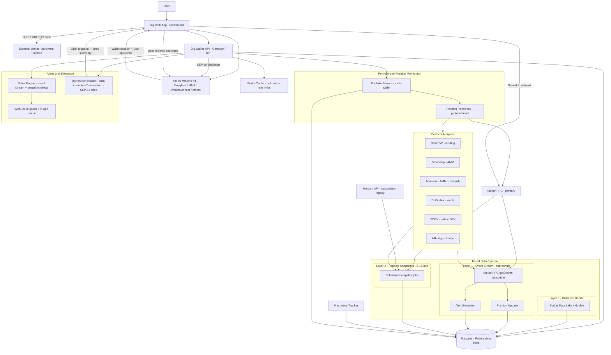
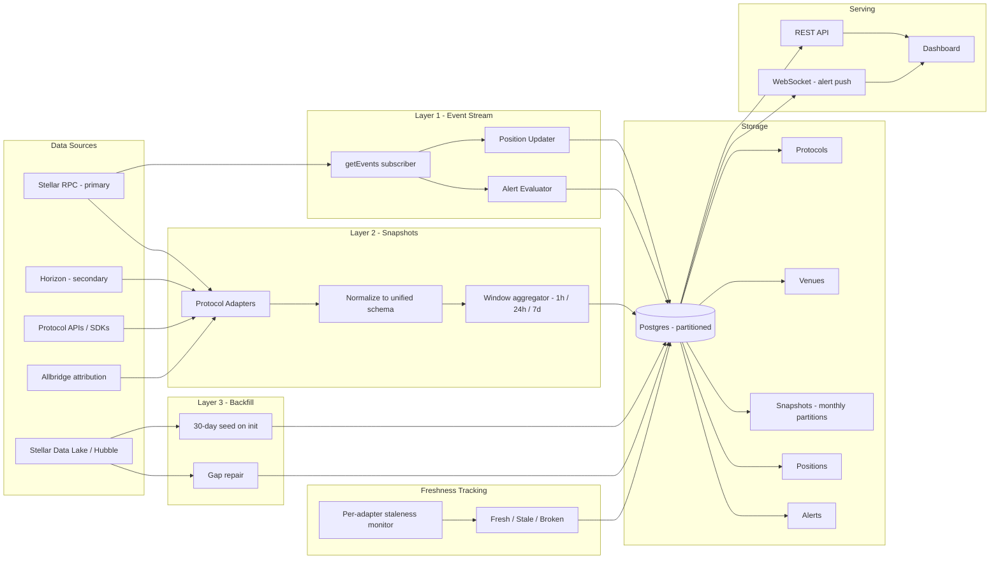
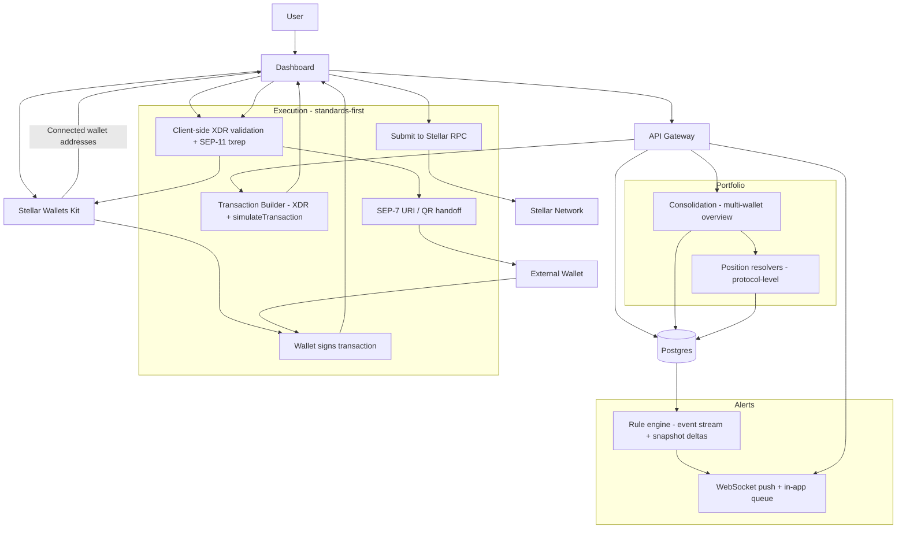

# Dig Stellar — Technical Architecture (Revised)

This document is the single source of truth for the technical architecture of Dig's Stellar module. It explains how we collect data, compute analytics, support multi-wallet portfolio monitoring, generate alerts, and enable optional non-custodial actions.

---

## 1. Objectives

Dig Stellar aims to increase ecosystem visibility and user effectiveness across Stellar DeFi by delivering:

- Protocol analytics and comparisons across integrated DeFi protocols
- Multi-wallet portfolio monitoring with consolidated exposure
- In-app alerting based on on-chain activity and metric deltas
- Optional non-custodial action proposals that users approve and sign in their wallet

### High-Level System Architecture



---

## 2. Core Design Principles

- **Protocol-first indexing**: we index the integrated DeFi protocols deeply rather than attempting full-chain indexing. Adapters are the primary unit of integration.
- **Tiered data freshness**: event-driven reads for user-impacting state (positions, liquidations, pool reserves), periodic snapshots for aggregate analytics, bulk backfill for historical context. One cadence does not fit all use cases.
- **Stellar RPC as the primary data plane**: we use Stellar RPC (JSON-RPC) for both classic and Soroban reads wherever supported, falling back to Horizon only for queries Stellar RPC does not yet serve well (full operation history, path payments, order-book depth). Horizon is treated as a legacy complement, not a peer.
- **Unified balance model across the SAC bridge**: the same asset may exist as a classic trustline holding and as a Soroban contract balance via the Stellar Asset Contract (SAC). Our data model treats these as views of a single underlying position.
- **Standards-first execution**: transaction handoff uses SEP-7 URIs and Stellar Wallets Kit. We do not invent custom signing flows where a Stellar standard already exists.
- **Non-custodial by construction**: the backend stores only public addresses and user preferences; it never sees private keys, and client-side validation of every XDR before signing is a first-class requirement, not an afterthought.
- **Explicit about ledger semantics**: we design around ~5-second ledger close times, deterministic finality (no reorgs), sequence number collisions, Soroban resource fees, and state archival. These are called out in the sections they affect.

---

## 3. Stellar Primitives Used (Inventory)

This section exists so a reviewer can see at a glance which Stellar and Soroban features the platform actually touches, and how each is handled.

### Classic Stellar Primitives

| Primitive | Where it matters | How we handle it |
|---|---|---|
| Trustlines | Balance tracking, execution preflight | We read trustline state per account. If a deposit requires a missing trustline, the transaction builder bundles a `ChangeTrust` operation into the same envelope. |
| Trustline flags (AUTH_REQUIRED, AUTH_REVOCABLE, clawback) | Risk signals | We surface these on the asset detail view and flag them in portfolio exposure to the user. |
| Claimable balances | Portfolio completeness | Indexed per account via Horizon `/claimable_balances` endpoint and included in total exposure. |
| SDEX order book and path payments | Swap execution, price discovery | For SDEX-native swaps we build `PathPaymentStrictSend` / `PathPaymentStrictReceive` operations; quotes come from Horizon's `/paths/strict-*` endpoints. |
| Liquidity pools (classic) | Pool LP positions | Indexed via Horizon `/liquidity_pools` and `/accounts/{id}` pool-share balances. |
| Multisig (weighted thresholds) | Execution safety | We detect account thresholds before proposing transactions and flag when a single signature will not meet the operation threshold. |
| Fee bump transactions (CAP-15) | UX for fee abstraction | Optionally supported for user-flow experiments where Dig or a partner sponsors inclusion fees for an inner transaction. Not in scope for T1 but architected for. |
| Sequence number / preconditions (CAP-21) | Transaction reliability | Handled by the transaction builder using `loadAccount` → `nextSequenceNumber`; min time/ledger bounds set conservatively. |

### Soroban Primitives

| Primitive | Where it matters | How we handle it |
|---|---|---|
| Contract events | Real-time alerting, position updates | We subscribe via Stellar RPC `getEvents` filtered to the contract IDs of integrated protocols. |
| `simulateTransaction` (preflight) | Transaction building | Every Soroban transaction proposal is preflighted; the returned footprint, resource fees, and auth entries are attached to the XDR before presentation. |
| Resource fees (CPU instructions, memory, I/O, events) | Cost estimation | Fee budget is set from simulation output with a safety margin; surfaced to the user in the proposal UI. |
| Soroban storage types (Temporary, Persistent, Instance) | Data freshness model | Temporary entries are re-fetched on every read; Persistent entries are cached with TTL-aware invalidation. |
| State archival and TTL | Long-lived positions | For Persistent entries we monitor TTL; if a restore is required for an action, we bundle `restore_footprint` into the transaction. |
| `SorobanAuthorizationEntry` | Delegated auth flows | Handled through `simulateTransaction` output; we do not construct auth entries manually unless a protocol adapter requires it. |
| Stellar Asset Contract (SAC) | Unified balance across classic/Soroban | Classic and SAC balances are reconciled under a single asset key in the data model. |

### Relevant SEPs

| SEP | Purpose | Our usage |
|---|---|---|
| SEP-10 | Web authentication with a Stellar account | Used for authenticated API requests; proves wallet control without exposing keys. |
| SEP-7 | Transaction URIs (`web+stellar:tx?xdr=…`) | Used for cross-wallet handoff — users can route a generated proposal to any SEP-7-compatible wallet. Replaces the need for a custom "switch signer" flow. |
| SEP-11 (txrep) | Human-readable transaction envelopes | Used in the proposal UI to show a plain-English summary of the XDR the user is about to sign. |

### Not in Scope

We explicitly exclude passkey-based smart accounts, anchor integrations (SEP-24/31), and custom Soroban contracts of our own deployment. All on-chain logic is handled by the integrated protocols; Dig is a read/orchestration layer.

---

## 4. Data Sources and RPC Strategy

The pipeline ingests from four source types, each with a specific role and latency profile.

**Stellar RPC (primary)** — Stellar RPC is our main source for both classic and Soroban reads. We use `getLedgerEntries` for account and contract state, `getEvents` for real-time Soroban event subscriptions, and `simulateTransaction` for preflight. Stellar RPC retains most methods' history for ~7 days, which sets our in-RPC lookback window.

**Horizon (secondary)** — Horizon is used where Stellar RPC does not yet offer a good equivalent: operation history beyond the RPC window, path-payment quote generation (`/paths/strict-send`, `/paths/strict-receive`), order-book depth (`/order_book`), and `/claimable_balances` lookups. We treat Horizon as a legacy complement that may be further deprecated and isolate Horizon-dependent code behind a single adapter so it can be replaced.

**Protocol-native sources** — Where a protocol exposes a well-maintained SDK or off-chain API (e.g., metadata, curated market lists), we use it. We do not rely on these for state-of-truth; any metric that enters an alert rule must be derivable from on-chain data as the source of truth.

**Historical backfill** — Stellar RPC's 7-day window is insufficient for trend analytics. For backfill we use Stellar Data Lake / Hubble (SDF's BigQuery-hosted public dataset) for classic ledger history, and Galexie for self-hosted bulk ingestion if the project grows. Backfill runs once on adapter initialization and then opportunistically to repair gaps.

**RPC provider strategy** — We will not rely on public SDF endpoints in production; rate limits make them unsuitable for continuous indexing. For Mainnet launch (T3) we use a paid RPC provider (candidates: Validation Cloud, Nownodes, Blockdaemon) with a secondary endpoint for failover. For Testnet (T2) the free tiers and SDF public endpoints are sufficient. This is a committed line item in our operational budget.

---

## 5. Tiered Data Pipeline

The original architecture treated all data with a single 5–15 minute snapshot cadence, which cannot support the alerting use case. The revised architecture runs three layers in parallel.

### 5.1 Layer 1 — Event Stream (sub-minute)

A long-running subscriber connects to Stellar RPC `getEvents` with filters for the contract IDs of every integrated protocol. Events are consumed as they are emitted (Stellar ledger close ~5 s) and dispatched to two sinks:

- **Position updater**: deposits, withdrawals, borrows, repayments, and liquidation events trigger immediate position recomputation for any tracked wallet involved.
- **Alert evaluator**: events matching user-configured rules (e.g., liquidation threshold crossed, large netflow) generate alerts within one ledger close of the triggering event.

This layer is the critical path for user-facing latency. Its data does not need to be persisted in full — events are an update stream, and the authoritative state lives in the snapshot and position tables.

### 5.2 Layer 2 — Periodic Snapshots (5–15 minutes)

Scheduled jobs read aggregate protocol state and write time-windowed snapshots. These power dashboards and trend charts where sub-minute freshness is not required:

- Pool TVL, reserves, and utilization for lending markets
- APY / APR curves
- Trading volume aggregations
- Netflow aggregations across 1h / 24h / 7d windows

Snapshots are stored in a partitioned time-series structure (see §6). The cadence is per-adapter — high-activity protocols can run on 5-minute cadence, slower markets on 15.

### 5.3 Layer 3 — Historical Backfill (one-shot + repair)

On adapter initialization, we pull historical data from Stellar Data Lake / Hubble to seed at least 30 days of snapshots for trend charts. Subsequent gaps (from indexer downtime, RPC outages) are detected via the freshness tracker (§5.4) and repaired from the data lake or Horizon.

### 5.4 Freshness Tracking and Failure Modes

Every adapter reports its last successful ingest timestamp per venue. The system surfaces staleness at three levels:

- **Fresh** (default): most recent ingest within expected cadence window.
- **Stale** (soft): ingest missed by more than 2× the expected cadence — the UI shows a "data may be delayed" badge; alerts on this venue are held in a 10-minute buffer to avoid false positives from missing data.
- **Broken** (hard): ingest missed for more than 30 minutes — the venue is excluded from aggregate rollups, a protocol-health alert fires to the team ops channel, and the adapter enters exponential backoff retry.

Unlike EVM chains, Stellar has deterministic finality — there are no reorgs to reconcile. This simplifies the pipeline: any event successfully read from a closed ledger is final.

### Pipeline Overview



---

## 6. Data Model

The following is representative Prisma-style pseudo-schema — exact field types and indexes are defined in `packages/db/prisma/schema.prisma`.

```
Protocol
  id            uuid
  key           string (unique, e.g., "blend-v2")
  name          string
  category      enum (lending, amm, vault, bridge, dex)
  chainId       string (network passphrase hash)
  websiteUrl    string

Venue
  id            uuid
  key           string (unique per protocol, e.g., "blend-pool-usdc")
  protocolId    uuid (ref Protocol)
  venueType     enum (pool, market, vault, orderbook_pair, bridge_route)
  contractId    string (Soroban contract address, nullable for classic-only venues)
  assets        Asset[] (many-to-many)
  metadata      jsonb (protocol-specific extensions)

Asset
  id            uuid
  code          string
  issuer        string (nullable for XLM native)
  sacContractId string (nullable — address of the corresponding SAC)
  decimals      int

Snapshot (partitioned by month)
  id            uuid
  venueId       uuid (ref Venue)
  capturedAt    timestamptz (indexed)
  tvlUsd        numeric
  volume24hUsd  numeric
  apy           numeric (nullable)
  utilization   numeric (nullable)
  netflow1hUsd  numeric
  netflow24hUsd numeric
  extra         jsonb
  sourceVersion string (adapter version that produced this row)

Position
  id            uuid
  accountId     string (Stellar account — "G…")
  venueId       uuid (ref Venue)
  balanceRaw    string (stringified i128 from Soroban, nullable for classic)
  balanceUsd    numeric
  collateralUsd numeric (nullable)
  debtUsd       numeric (nullable)
  healthFactor  numeric (nullable — Blend and similar only)
  capturedAt    timestamptz
  isActive      boolean (soft-delete for closed positions)

TrackedAddress
  id            uuid
  userId        uuid
  address       string (Stellar G-address)
  label         string
  isActiveSigner boolean
  multisigDetected boolean
  thresholds    jsonb (low, med, high — populated if multisig)

AlertRule
  id            uuid
  userId        uuid
  scope         enum (protocol, venue, wallet, global)
  scopeRef      string (venue key, wallet address, etc.)
  metric        enum (tvl_delta, apy_delta, utilization, netflow, health_factor, custom)
  operator      enum (gt, lt, pct_change_gt, pct_change_lt)
  threshold     numeric
  window        interval
  cooldown      interval
  severity      enum (info, warning, critical)

Alert
  id            uuid
  ruleId        uuid
  triggeredAt   timestamptz
  context       jsonb (values at trigger time)
  acknowledgedAt timestamptz (nullable)
```

**Time-series strategy.** The `Snapshot` table is declaratively partitioned by `capturedAt` in monthly partitions. If query load demands, we migrate to TimescaleDB hypertables — the schema is designed to allow this without application-level change.

**Balance representation.** Soroban token balances are i128, which exceeds JS Number and is larger than Postgres bigint. We store raw balances as strings and compute USD values at ingest time using Reflector oracle prices plus protocol-native rates where applicable.

---

## 7. Protocol Adapters — Specific Integrations

Each adapter below specifies the actual read path and the specific contract/endpoint surface.

### 7.1 Blend V2 (lending)

- **Contracts**: Pool contracts (per-market), Backstop, Emitter. Contract IDs resolved from Blend's public registry.
- **State reads**: `get_reserve(asset)` for each pool asset returns reserve data (supplied, borrowed, rate model state). `get_positions(user)` returns a user's collateral and liability across the pool.
- **Event subscriptions**: `supply`, `withdraw`, `borrow`, `repay`, `liquidate` events per pool contract via `getEvents`.
- **Derived metrics**: utilization per asset, pool APY curves, user health factor (computed from positions and oracle prices), liquidation thresholds.
- **Oracle dependency**: Blend uses Reflector for price feeds; our adapter reads Reflector prices directly for consistency with what the protocol sees on-chain.

### 7.2 Soroswap (AMM)

- **Contracts**: Factory (pair registry) and Router. Pair contracts per token pair.
- **State reads**: Factory `all_pairs_length` and `all_pairs(i)` to enumerate; Pair `get_reserves()` for pool state; LP token balances per user via SAC.
- **Event subscriptions**: `swap`, `deposit` (mint), `withdraw` (burn), `sync` events.
- **Quote generation**: Router `router_get_amounts_out` via `simulateTransaction` for swap previews.
- **Derived metrics**: pool TVL (reserves × oracle price), 24h volume (sum of swap event amounts), LP holder distribution, implied APR from fees.

### 7.3 Aquarius (AMM with rewards)

- **Scope**: Aquarius operates both classic AMM pools and Soroban AMMs; the adapter handles both via the classic `/liquidity_pools` Horizon endpoint and Soroban contract reads respectively.
- **Rewards**: AQUA emissions per pool are read from the rewards contract; user claimable AQUA is indexed and surfaced in portfolio rewards.
- **Derived metrics**: TVL, volume, effective APR including emissions.

### 7.4 DeFindex (yield vaults)

- **Contracts**: Vault contracts implementing a standard share-token interface over one or more underlying strategies (often Blend-based).
- **State reads**: vault `total_assets()`, `total_supply()`, `balance_of(user)`, plus strategy-specific reads to attribute underlying exposure.
- **Derived metrics**: share-to-asset ratio over time → vault APY; user underlying exposure decomposed by strategy.

### 7.5 SDEX (native DEX)

- **Reads via Horizon**: `/order_book`, `/trades`, `/accounts/{id}/offers`.
- **Execution**: `PathPaymentStrictSend` / `PathPaymentStrictReceive` operations; paths discovered via `/paths/strict-send` and `/paths/strict-receive`.
- **Derived metrics**: top pairs by 24h volume, spread/depth per pair, user open offers.

### 7.6 Reflector (oracle dependency, not a venue)

Reflector is consumed by Blend and (optionally) by our own USD conversions. We read Reflector price feeds directly for consistency and do not present Reflector as a venue — it is infrastructure.

### 7.7 Bridge Flows — Allbridge (T2 scope)

Bridge inflow/outflow to Stellar is tracked via Allbridge's attribution data. Axelar and Near Intents remain out of scope for the grant period; we will reassess once Allbridge integration proves the dashboard pattern.

---

## 8. Execution Model

### 8.1 Principles

- Every transaction proposal is an XDR constructed server-side from current indexed state plus a live `loadAccount` call for sequence number.
- Every Soroban transaction is preflighted via `simulateTransaction` before presentation; the returned footprint, resource fees, and auth entries are attached.
- The user always signs in-wallet. The backend never sees private keys and never submits a transaction the user has not explicitly approved.
- Proposals are validated client-side before signing: the frontend decodes the XDR, verifies the operations match the user's declared intent, and renders a SEP-11 txrep summary.

### 8.2 Transaction Builder

For each supported action, the adapter specifies the operation sequence. For example, a first-time deposit to a Blend pool might bundle:

1. `ChangeTrust` — if the user lacks a trustline for the deposit asset (classic operation).
2. `InvokeHostFunction` — calling Blend's `submit()` with the deposit action (Soroban operation).
3. Optionally `restore_footprint` — if the Soroban contract's persistent entries have expired TTL.

All three are combined into a single `TransactionEnvelope` and preflighted. Fees are set to the max of the inclusion fee (classic) plus the resource fee returned by simulation, with a configurable safety margin (default 50%).

### 8.3 Fee and Auth Handling

- **Classic inclusion fees**: default to 1000 stroops per operation, adjustable via user preference.
- **Soroban resource fees**: derived from `simulateTransaction.minResourceFee` plus safety margin.
- **Authorization**: for most protocol interactions the user is the sole invoker (`InvokerContractAuthEntry` is attached by the SDK). Cross-contract auth chains (e.g., a vault that authorizes a strategy) are handled by taking the full auth array from simulation output.

### 8.4 Multi-Wallet Execution

We do not invent a signer-switch protocol. Instead:

- **Watch mode**: all tracked addresses can be viewed in portfolio aggregation; no signing is possible from a watch-only address.
- **Connected mode**: when a user connects a wallet via Stellar Wallets Kit, they can sign for the controlled address. Multiple wallets can be connected simultaneously if the wallet providers support it.
- **SEP-7 handoff**: for any address the user doesn't have a live wallet connection to (hardware-held, mobile-held), the proposal is emitted as a `web+stellar:tx?xdr=…` URI / QR code. Any SEP-7-compatible wallet can scan, sign, and submit. This is the clean answer to the "sign from a different wallet" question.
- **Multisig detection**: on adding a tracked address, we read the account's signers and thresholds. If the account is multisig, the UI shows the threshold requirements; proposals for that address display a signing progress indicator and accept multiple partial signatures (stored ephemerally client-side until threshold is met, then submitted).

### 8.5 Execution Flow (end-to-end)

1. User selects an action and source address.
2. Backend returns: the XDR, the decoded txrep summary, simulation results (for Soroban), and a SEP-7 URI as an alternate handoff.
3. Frontend re-decodes and validates the XDR matches the user's stated intent; surfaces the txrep summary and fee breakdown.
4. User signs via Wallets Kit (connected case) or via SEP-7 on another device (handoff case).
5. Frontend submits to Stellar RPC `sendTransaction` and polls `getTransaction` for status.
6. On SUCCESS, the frontend optimistically updates portfolio state; authoritative update follows from the event-stream layer (§5.1) within one ledger close.



## 6 bis. Protocol Integration Model

Dig integrates Stellar DeFi protocols through a unified adapter layer, with two levels of support depending on integration depth:

- **Read-only**: analytics, metrics, positions, and monitoring  
- **Execution**: non-custodial on-chain interactions through transaction proposals  

Each protocol is integrated via a dedicated adapter, then normalized into a shared internal model (protocol → pools → reserves → snapshots). When execution is supported, interactions follow a consistent transaction lifecycle across protocols.

### 6 bis.1 Integration overview

| Protocol   | Type     | Mode                  | Supported interactions |
|------------|----------|-----------------------|------------------------|
| Blend      | Lending  | Execution             | Supply, withdraw, borrow, repay, claim rewards, position monitoring |
| Soroswap   | AMM      | Execution             | Swaps, add/remove liquidity, fee claiming, LP management |
| Aquarius   | AMM      | Execution             | Swaps, add/remove liquidity, fee claiming |
| SDEX       | DEX      | Execution             | Order placement, cancellation, path payments |
| DeFindex   | Vault    | Execution             | Deposit, withdraw, yield tracking, strategy exposure |
| Allbridge  | Bridge   | Read-only             | Cross-chain inflow/outflow tracking, bridge volume monitoring |

### 6 bis.2 Integration model

Each protocol adapter is responsible for:

- fetching and normalizing protocol-specific data into the unified schema  
- resolving positions for portfolio aggregation and alerting  
- exposing execution capabilities where supported  

Execution-enabled protocols share a common transaction lifecycle:

build → simulate → sign → submit → track  

The underlying logic varies depending on protocol type:

- AMMs follow a similar pool interaction model, allowing reuse of transaction builders across protocols  
- Lending protocols require stateful position tracking and risk-aware execution (collateral, borrow, health factor)  
- Vault protocols introduce strategy-level abstractions and indirect exposure  

### 6 bis.3 Read-only vs execution separation

Not all protocols require execution support from the start.

Dig separates:

- **analytics-first integrations**, focused on visibility, monitoring, and ecosystem understanding  
- **execution-enabled integrations**, where users can directly interact with protocols from the interface  

This approach allows fast integration of new protocols while progressively enabling deeper interaction where it provides clear user value.

### 6 bis.4 Bridge integration (Allbridge)

Allbridge is integrated as a data source for cross-chain flow attribution, not as an execution layer at this stage.

It enables:

- tracking inflows and outflows of assets entering or leaving the Stellar ecosystem  
- attributing liquidity movements across chains where data is available  
- enriching protocol and asset-level analytics with cross-chain context  

This data is used in snapshots, dashboards, and alerting, particularly for detecting flow-driven changes in liquidity and activity.

## 7. Alerting and Risk Signals

The alerting system turns on-chain activity and metric changes into actionable in-app signals. Alerts are computed from a combination of time-windowed snapshots and protocol activity streams.

### 7.1 Data inputs
Alerts are derived from:
- **Snapshot deltas**: changes between recent snapshots for a venue or protocol, such as TVL or liquidity moves, yield changes, utilization shifts, and netflow spikes
- **Soroban contract events**: protocol-level events that indicate meaningful state changes
- **Horizon ledger activity**: classic operations and transfers that help detect flows or unusual activity patterns

### 7.2 Alert types
We group alerts into two categories:

**Protocol alerts** (ecosystem visibility)  
- liquidity or TVL drops and spikes
- yield changes beyond a threshold
- utilization shifts for lending markets
- abnormal activity indicators, such as sudden volume or flow spikes
- protocol health indicators, such as stale data or missing updates

**Portfolio alerts** (user exposure)  
- position exposure changes for a tracked address
- rewards changes or claimable balance changes where applicable
- concentration signals, such as a large exposure to a single venue
- execution-relevant signals, such as a sharp liquidity drop on a venue the user is exposed to

Each portfolio alert is tagged with the wallet address it relates to, so multi-wallet users can see both per-wallet and aggregated feeds.

### 7.3 Rules engine and severity
Alerts are generated by a rules engine that evaluates:
- absolute thresholds, for example liquidity below a minimum level
- relative changes over a window, for example a 24h drop percentage
- anomaly flags derived from time series behavior, for example an outlier netflow spike

Each alert is assigned a severity level (info, warning, critical) and includes:
- what changed
- the affected protocol and venue
- the impacted wallet address when relevant
- the time window used for the detection

### 7.4 Noise reduction and user experience
To keep the feed useful, the system applies:
- cooldown windows to prevent repeated alerts for the same condition
- grouping of related events into a single alert where possible
- user-configurable preferences per protocol and per wallet address
- clear links from an alert to the relevant dashboard view and suggested next steps when applicable

Alerts are delivered directly in-app and can be extended with additional channels later if required.

### 7.5 Example alerts

| Alert name | Trigger signal | Rule (example) | Scope | Result shown in-app |
|---|---|---|---|---|
| Liquidity drop | Venue liquidity snapshot delta | liquidity drops by more than X percent in 1h | Protocol / venue | Warning with link to venue page |
| Yield shift | APY or rate snapshot delta | APY changes by more than X basis points in 24h | Protocol / venue | Info or warning with trend context |
| Netflow spike | Inflow/outflow delta | netflow exceeds X over 1h window | Protocol / asset | Warning with flow breakdown |
| Utilization spike | Lending market utilization | utilization exceeds X or jumps by X in 1h | Protocol / market | Warning with risk context |
| Portfolio exposure change | Position delta for wallet | exposure changes by more than X percent | Wallet | Wallet-tagged alert with link to portfolio |

## 8. Data Pipeline and Snapshots

This module is built around a protocol-first indexing pipeline that normalizes heterogeneous sources into a unified schema and produces time-windowed snapshots for analytics, portfolio monitoring, and alerting.

### 8.1 Data sources
We ingest and enrich data from:
- **Horizon**: ledger operations, balances, trustlines, and classic activity signals
- **Soroban RPC**: contract events and state reads required for protocol-level metrics and positions
- **Protocol APIs or SDKs**: protocol-native market metadata and rate data where available
- **Bridge sources**: cross-chain flow attribution where available, starting with Allbridge

### 8.2 Adapter layer and normalization
Each integration is implemented as a protocol adapter that outputs normalized entities:
- **Protocol**: protocol identity and metadata
- **Venue**: a concrete object such as pool, market, vault, or bridge
- **Snapshot**: time-windowed metrics for a venue at a given timestamp

Adapters are responsible for mapping protocol-specific fields into the unified schema and providing consistent keys for venues to enable stable time-series tracking.

### 8.3 Snapshot cadence and time windows
Snapshots are produced on a predictable cadence (e.g., every 5–15 minutes) to balance freshness and cost. The system supports multiple analysis windows:
- short window for rapid changes, such as 1 hour
- medium window for daily trends, such as 24 hours
- longer window for weekly context, such as 7 days

### 8.4 Metrics computed in snapshots
Typical snapshot fields include:
- liquidity or TVL where applicable
- volume and activity indicators
- yield or rate indicators where available
- utilization indicators for lending markets where applicable
- inflow, outflow, and netflow metrics at the venue or asset level where attribution is available
- a flexible data field for protocol-specific extensions

### 8.5 Data freshness and reliability
The pipeline tracks freshness per source and per venue. If a venue becomes stale, the system:
- marks the venue metrics as stale in the UI
- can generate protocol health alerts
- retries indexing jobs with backoff to recover from temporary failures

This ensures analytics remain transparent even when upstream sources are delayed.

### 8.6 Flow computation - inflow, outflow, netflow

Flow metrics are computed as time-windowed aggregates derived from on-chain activity:
- **Asset-level flows** are computed from Horizon operations and transfers over a given window, producing inflow, outflow, and netflow per asset.
- **Protocol-level flows** are derived from protocol activity (Soroban events and adapter data) by classifying movements such as deposits and withdrawals where supported.
- **Bridge flows** are computed from bridge-related activity where attribution is available, producing cross-chain inflow and outflow snapshots for selected assets.

Each flow snapshot is linked to a protocol and or venue key when possible, and stored alongside other metrics to support dashboards and alert triggers.

### 8.7 Deeper view - indexing pipeline and storage

The diagram below expands the data pipeline with the internal building blocks: collectors, protocol adapters, normalization, time-window aggregation, freshness tracking, and the main persisted entities used by analytics, portfolio, and alerting.

```mermaid
flowchart LR
  subgraph Sources[Sources]
    Horizon[Horizon API]
    Soroban[Soroban RPC]
    Prot[Protocol APIs or SDKs]
    Bridge[Bridge data - Allbridge]
  end

  subgraph Indexing[Indexing]
    Fetch[Collectors]
    Adapt[Protocol adapters]
    Normalize[Normalize to unified schema]
    Window[Window aggregator - 1h 24h 7d]
    Fresh[Freshness tracking]
  end

  subgraph Storage[Storage]
    DB[(Postgres - Prisma)]
    ProtoT[Protocols]
    VenueT[Venues]
    SnapT[Snapshots]
    PosT[Positions]
    AlertT[Alerts]
  end

  subgraph Serving[Serving]
    API[REST API]
    Dash[Dashboard]
    Feed[Alerts feed]
  end

  Horizon --> Fetch
  Soroban --> Fetch
  Prot --> Fetch
  Bridge --> Fetch

  Fetch --> Adapt --> Normalize --> Window --> DB
  Fresh --> DB

  DB --> ProtoT
  DB --> VenueT
  DB --> SnapT
  DB --> PosT
  DB --> AlertT

  DB --> API --> Dash
  DB --> API --> Feed
  ```

## 9. Reference Implementation in this Repository

This repository includes a minimal executable reference implementation that demonstrates the end-to-end flow from indexing to storage to API serving.

### 13.1 Local stack
- **Postgres** as the primary datastore for protocols, venues, and snapshots
- **Prisma** schema and migrations in `packages/db`
- **NestJS API** in `apps/api`
- **Indexer job** in `apps/indexer` with a run-once command

### 13.2 Quickstart
1) Start services: `docker compose up -d`
2) Apply database schema: `cd packages/db && pnpm prisma:migrate`
3) Run the indexing job: `pnpm -C apps/indexer run:once`
4) Start the API: `pnpm -C apps/api start:dev`

### 13.3 Demo endpoints
- `GET /health`
- `GET /protocols`
- `GET /venues/:key/snapshots?limit=...`

### 13.4 How to add a new protocol integration
1) Implement a protocol adapter that fetches protocol data from Stellar RPC, Horizon, and/or protocol APIs
2) Map outputs into the unified entities: Protocol, Venue, Snapshot
3) Add a job to refresh snapshots on a per-adapter cadence
4) Expose additional endpoints in the API if needed

---

## 14. Scope and Assumptions

The initial scope focuses on protocol analytics, multi-wallet portfolio monitoring, in-app alerting, and optional non-custodial action proposals on supported protocols. Bridge flow monitoring starts with Allbridge where attribution data is available. Additional cross-chain integrations such as Axelar or Near Intents are considered optional extensions depending on ecosystem alignment and data attribution feasibility.

## 11. Security, Privacy, and Reliability

Dig follows a strictly non-custodial design. Users always approve and sign transactions in their wallet via Stellar Wallets Kit. The backend stores only public addresses and user preferences, and never stores private keys or secrets.

Reliability is ensured through predictable snapshot cadences, retries with backoff for indexing jobs, and freshness tracking per venue. Stale data is explicitly surfaced and can trigger protocol health alerts.

## 12. Observability

Indexing jobs emit structured logs and basic counters such as snapshots written per run, source latency, and RPC error rates. The API provides health endpoints to support basic monitoring during development and production rollout.
