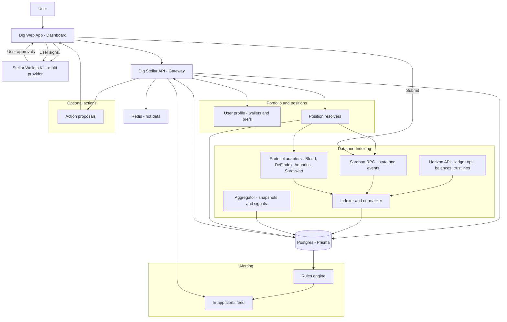
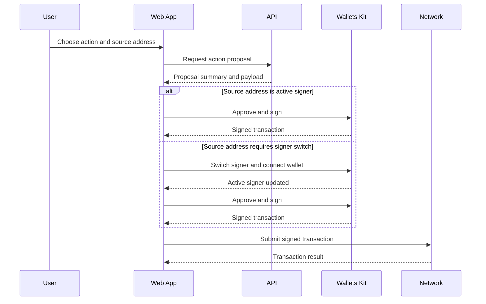

# Dig Stellar — Technical Architecture

This document is the single source of truth for the technical architecture of Dig’s Stellar module. It explains how we collect data, compute analytics, support multi-wallet portfolio monitoring, generate alerts, and enable optional non-custodial actions.

---

## 1. Objectives

Dig Stellar aims to increase ecosystem visibility and user effectiveness across Stellar DeFi by delivering:

- Protocol analytics and comparisons across integrated DeFi protocols
- Multi-wallet portfolio monitoring with consolidated exposure
- In-app alerting based on on-chain activity and metric deltas
- Optional non-custodial action proposals that users approve and sign in their wallet

---

## 2. Core Design Principles

- Protocol-first indexing: focus on the integrated DeFi protocols rather than full-chain indexing
- Near real-time snapshots: metrics are stored as time-windowed snapshots on a predictable cadence
- Modular adapter layer: integrate protocols via dedicated adapters and normalize to a unified schema
- Non-custodial execution: Dig never holds keys; users sign in-wallet
- Multi-wallet is explicit: one connected wallet plus optional user-added watch addresses

---

## 3. High-level System Architecture

---

## 4. Wallet Integration and User Connection Model

# 4.1 Multi-provider wallet connectivity

Dig uses Stellar Wallets Kit as the frontend integration layer to connect Stellar wallet providers (e.g., Freighter, xBull, WalletConnect, Albedo) and request user approvals/signatures. Wallet access remains fully non-custodial: Dig never receives private keys and signatures are always performed in-wallet.

# 4.2 User profile and stored configuration

Dig stores only non-sensitive configuration:
	•	tracked wallet addresses selected by the user
	•	labels and grouping preferences
	•	alert preferences and thresholds
	•	current session context (which address is the active signer)

---

## 5. Multi-Wallet Portfolio and Signing Experience

# 5.1 Tracked addresses and active signer

To maximize accessibility and time savings, Dig provides a single portfolio view across multiple wallet addresses. Users can add multiple Stellar addresses to track balances, DeFi positions, rewards, and alerts in one place.

At any time, one address is the active signer: the wallet currently connected through Stellar Wallets Kit in the session. Any tracked address can be used for execution by switching the active signer to that address when needed.

# 5.2 Signing from different wallets

Dig enables execution from multiple wallets through a simple, explicit signer model. Each action proposal is tied to a single source address. When a user initiates an action from the portfolio:
	•	If the source address is already the active signer, Dig returns an action proposal and the user signs in their wallet via Stellar Wallets Kit.
	•	If another tracked address is selected, the UI guides the user through a quick signer switch by opening the provider connection flow for that address, then replays the same action proposal for signature and submission.

This approach keeps execution fully non-custodial and user-controlled while offering a smooth multi-wallet experience.

# 5.3 UX guidance for signer switching

The UI always shows the current signer and provides a one-step “Switch signer” flow when required. Users can track multiple addresses in one dashboard and execute actions from any of them by connecting the relevant wallet for the action.

## 6. Signature and Execution Model (version clean + bullish)

# 6.1 Action proposals

Dig provides guided action proposals for supported protocols (e.g., swap, deposit, withdraw, supply/borrow where supported). Each proposal is always scoped to:
	•	a single source address (the signer)
	•	a target protocol and venue
	•	a clear user-facing summary of the intended effect

Proposals are built from the latest indexed state (snapshots + relevant on-chain reads). Where supported, Dig may run Soroban simulation to help validate expected behavior before presenting the proposal to the user.

# 6.2 Signer selection and multi-wallet execution

Dig supports execution from multiple wallets through an active signer model:
	•	The user selects the source address for an action (from their tracked addresses).
	•	If the source address matches the current active signer, the user can sign immediately via Stellar Wallets Kit.
	•	If another source address is selected, the UI triggers a guided signer switch (connect the wallet that controls that address), then continues with the same proposal flow.

This design keeps execution fully non-custodial and user-controlled while enabling a smooth multi-wallet experience.

# 6.3 End-to-end execution flow
	1.	User selects an action and a source address
	2.	Dig API returns an action proposal (summary + transaction payload)
	3.	UI requests approval and signature via Stellar Wallets Kit
	4.	UI submits the signed transaction to the network
	5.	UI displays the result and updates portfolio metrics as new events/snapshots arrive

# 6.4 Result handling and feedback in the dashboard

After submission, Dig:
	•	displays transaction status (submitted / confirmed / failed)
	•	updates the relevant venue and portfolio views as new on-chain events are indexed
	•	can trigger follow-up alerts if post-execution metrics change (e.g., exposure or utilization shifts)

