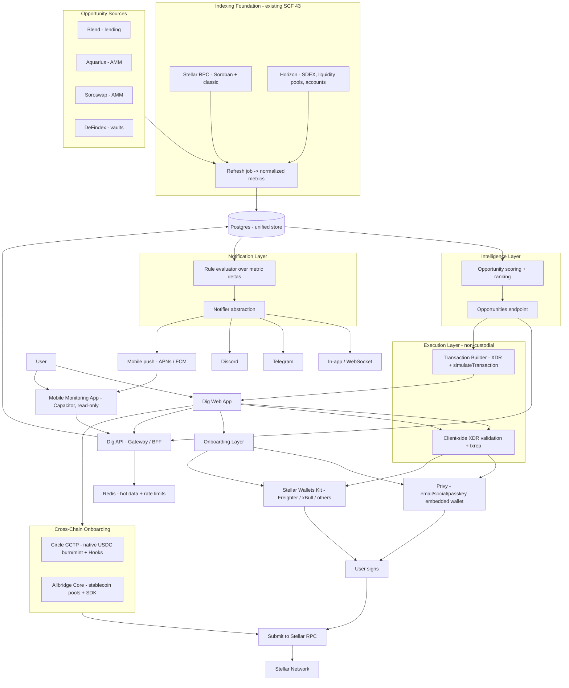
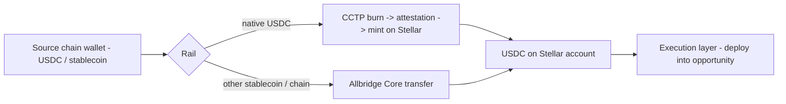
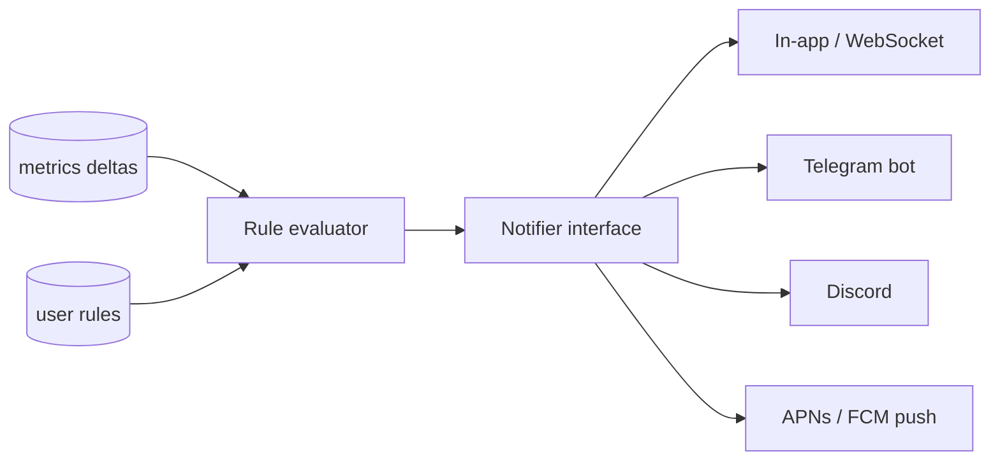

# Dig — Stellar DeFi Intelligence & Execution Gateway — Technical Architecture

This document is the technical architecture for Dig's accelerator-scope product: an
intelligence and execution gateway for Stellar DeFi. It is self-contained — it restates the
foundational layers it depends on — and Stellar-specific throughout. For the full reference
implementation of the underlying indexing and analytics infrastructure (delivered under SCF 43),
see the repository's main `docs/TECHNICAL_ARCHITECTURE.md`; this document focuses on the new
layers and, for the integration track, on exactly how each Stellar building block is integrated.

---

## 1. Objectives

Dig is building the simplest gateway to Stellar DeFi. Where existing tools stop at read-only
analytics, this product closes the loop from information to action:

- **Discover** — continuously analyze the Stellar DeFi ecosystem and surface the most relevant
  yield and liquidity opportunities, ranked and explained.
- **Onboard** — let any user, crypto-native or not, enter with minimal friction (email / social
  login, or an existing wallet) and hold a self-custodial Stellar account.
- **Act** — execute the on-chain action behind an opportunity in one click, with the transaction
  built server-side and signed exclusively in the user's wallet.
- **Bring capital in** — move native USDC and other stablecoins from external chains into Stellar
  and deploy directly into an opportunity.

The product is non-custodial by construction: the backend stores only public addresses and user
preferences, and never holds private keys or signs on a user's behalf.

---

## 2. Relationship to the Existing Infrastructure

This scope is an extension of Dig's existing Stellar work, built in the same monorepo. The
following layers already exist and are reused as the foundation — they are not rebuilt here:

- **Hybrid indexing pipeline** — a Horizon + Soroban RPC ingestion pipeline normalizing
  protocol data into a unified Postgres store, with a canonical refresh job producing latest
  per-pool and per-protocol metrics, reserve snapshots, and asset prices.
- **Protocol analytics API** — internal endpoints serving TVL, volume, and APY for the
  integrated protocols (Blend, Aquarius, Soroswap) plus the native Stellar DEX.
- **Grouped multi-wallet portfolio** — persistent grouping of multiple tracked addresses per
  user, with balance snapshots and per-wallet refresh.
- **Non-custodial transaction builder** — server-side construction of multi-operation XDR
  envelopes (e.g., `ChangeTrust` + a swap/deposit), client-side validation, and in-wallet
  signing via Stellar Wallets Kit, proven end-to-end on Testnet.

The new layers below — intelligence/ranking, frictionless onboarding, one-click execution,
cross-chain onboarding, notifications, and mobile monitoring — are built on top of these.

---

## 3. System Architecture



---

## 4. Core Design Principles

- **Non-custodial by construction.** The backend stores only public addresses and preferences.
  Every action is a proposal: an XDR built server-side, validated client-side, and signed in the
  user's wallet. The backend never sees a private key and never submits an unapproved transaction.
- **On-chain as source of truth.** Any metric that drives an opportunity ranking or an alert is
  derivable from on-chain state (Soroban contract reads, Horizon, Reflector oracle prices).
  Off-chain SDKs/APIs are used for metadata and convenience, never as the authoritative source.
- **Reuse over reinvention.** The intelligence and action layers sit on top of the existing
  indexing pipeline, transaction builder, and multi-wallet model rather than duplicating them.
- **Standards-first execution.** Transaction handoff uses Stellar Wallets Kit and SEP-7 URIs;
  human-readable summaries use SEP-11 txrep. No custom signing flows where a Stellar standard
  exists.
- **Explicit about ledger semantics.** The design accounts for ~5-second ledger close, deterministic
  finality (no reorgs), Soroban resource fees and storage TTL/archival, and the Protocol 20
  constraint on mixing classic and Soroban operations in a single envelope (see §7).

---

## 5. Stellar Building Blocks — Integration Plan

This is the heart of the integration. Each building block is listed with what it provides and the
concrete Stellar read/write path Dig uses to integrate it. Two families: **opportunity sources**
that feed the intelligence layer, and **execution & onboarding rails** that enable action.

### 5.1 Opportunity Sources

| Source | Type | Read path | Signals extracted |
|---|---|---|---|
| **Blend** | Lending | Soroban RPC: pool `get_reserve(asset)`, `get_positions(user)`; events `supply/withdraw/borrow/repay/liquidate` | Supply/borrow APY, utilization, health-factor risk, liquidity depth |
| **Aquarius** | AMM (+ rewards) | Soroban contract reads (`get_info`, `get_reserves`) and classic `/liquidity_pools` via Horizon; rewards contract for AQUA emissions | Pool TVL, volume, effective APR incl. emissions |
| **Soroswap** | AMM | Soroban RPC: Factory enumeration, Pair `get_reserves()`, `getEvents` for swaps; Router quotes via `simulateTransaction` | Pool TVL, 24h volume, implied fee APR |
| **DeFindex** | Yield vaults | Soroban RPC: vault `total_assets()`, `total_supply()`, `balance_of(user)`, plus underlying strategy reads | Share-to-asset ratio over time → vault APY; underlying exposure |

> Extensibility: the opportunity model is built to accommodate tokenized real-world-asset (RWA)
> yield sources (e.g., Etherfuse Stablebonds, issued natively on Stellar and tradable via trustline
> + DEX) as an additional low-risk yield category, where feasible.

All sources are read through the existing indexing pipeline; integrating a new source means adding
an adapter that normalizes its state into the unified `Venue` / `Entity` / `Snapshot` / metrics
schema. No source provides authoritative pricing — USD values are computed at ingest using
Reflector oracle prices.

### 5.2 Execution & Onboarding Rails

| Rail | Provides | Integration path |
|---|---|---|
| **Stellar Wallets Kit + Freighter** | In-wallet signing for crypto-native users | Already integrated; the kit follows the runtime network toggle and signs XDR built by the API |
| **Privy** | Email / social / passkey onboarding → self-custodial embedded wallet on Stellar | Privy SDK provisions a Stellar account (EOA); the user signs proposals through Privy; keys are secured via TEE + key-splitting and never fully held by any party (see §6) |
| **Circle CCTP** | Native USDC cross-chain transfer (burn-and-mint, no wrapped assets) | Orchestrate burn on the source chain, await Circle attestation, submit mint on Stellar; CCTP hooks chain the on-destination deposit (see §8) |
| **Allbridge Core** | Cross-chain stablecoin swaps across many chains, incl. non-USDC | REST API / JS SDK; a single source-chain transaction transfers value to Stellar, with automatic trustline setup; can itself route USDC via CCTP (see §8) |

---

## 6. Onboarding & Wallet Layer

Onboarding is the top of the funnel and the main friction point for mainstream adoption. The layer
supports two modes side by side, both non-custodial, unified under the existing grouped
multi-wallet model.

**Crypto-native mode.** The user connects an existing wallet (e.g., Freighter) through Stellar
Wallets Kit. Signing happens in the user's wallet; nothing changes from the existing flow.

**Frictionless mode (Privy).** A new user authenticates with email, social login, or a passkey and
is provisioned a self-custodial Stellar account through Privy — no browser extension, no seed
phrase. The private key is secured through a combination of Trusted Execution Environments and
secret-sharing such that no single system, including Privy and including Dig, ever holds the
complete key; the user can export it at any time. The account is an externally-owned account (EOA)
on Stellar.

Both wallet types are tracked together in the consolidated portfolio (the existing
`user_wallets` model, extended with a provider/source qualifier). A watch-only address remains
read-only and can never be moved into a signing context without an explicit wallet connection.

**Multi-chain synergy with cross-chain onboarding.** Privy provisions wallets across EVM, Solana,
and Stellar from a single user identity. This is what makes the cross-chain onboarding flow (§8)
usable in one app session: the same Privy-managed identity can authorize the source-chain transfer
and the Stellar-side receipt, without the user juggling separate wallets per chain.

---

## 7. Execution Model

### 7.1 One-Click Action from an Opportunity

Each opportunity carries enough metadata for the transaction builder to construct the underlying
action. The flow:

1. The user selects an opportunity and a source account (a connected or Privy-provisioned wallet).
2. The API builds the transaction proposal server-side from current indexed state plus a live
   `loadAccount` for sequence number, bundling any required prerequisite (e.g., a missing
   `ChangeTrust`) where the protocol allows it in one envelope.
3. For Soroban actions, the proposal is preflighted via `simulateTransaction`; the returned
   footprint, resource fees, and auth entries are attached, and `restore_footprint` is bundled if a
   persistent entry's TTL has expired.
4. The frontend re-decodes the XDR, validates it matches the declared intent, and renders a SEP-11
   txrep summary plus fee breakdown.
5. The user signs in-wallet (Wallets Kit or Privy). The frontend submits to Stellar RPC
   `sendTransaction` and polls `getTransaction`.
6. On success, the portfolio updates optimistically; the authoritative update follows from the
   indexing layer.

### 7.2 Protocol 20 Constraint (decided)

Stellar Protocol 20 forbids mixing `InvokeHostFunction` (Soroban) with classic operations in a
single transaction envelope. This shapes how "one-click" maps to on-chain actions:

- **Classic actions (e.g., an SDEX swap)** can be a single multi-operation XDR — for example
  `ChangeTrust` + `PathPaymentStrictSend` in one envelope. This is the canonical single-XDR
  bundling demonstration.
- **Soroban actions (e.g., a Blend or DeFindex deposit)** cannot be bundled with a classic
  `ChangeTrust` in the same envelope. Where a trustline prerequisite exists, it is handled as a
  separate preceding transaction, then the `InvokeHostFunction` deposit follows. The one-click UX
  abstracts this as a guided sequence; the non-custodial guarantee holds for every step.

### 7.3 Fees and Authorization

Classic inclusion fees default conservatively per operation. Soroban resource fees are derived from
`simulateTransaction.minResourceFee` plus a safety margin. Cross-contract auth chains (e.g., a vault
authorizing an underlying strategy) are taken from the full auth array returned by simulation rather
than constructed manually.

---

## 8. Cross-Chain Onboarding

Bringing external capital into Stellar is served by two complementary rails. They are presented as
one capability with two paths, not two competing bridges.

### 8.1 Circle CCTP — native USDC

CCTP moves **native** USDC across chains by burning on the source chain and minting on the
destination, with no wrapped assets and no third-party liquidity pool. On Stellar it is implemented
through Soroban contracts. CCTP also supports hooks: metadata attached to a transfer can trigger an
action on the destination chain when the USDC is minted.

Dig's flow:

1. The user initiates a burn of USDC on the source chain (signed with their source-chain wallet —
   the same Privy identity where applicable).
2. Circle issues an attestation for the burn.
3. The attestation is submitted on Stellar to mint native USDC to the user's Stellar account.
4. Where applicable, a CCTP hook (or a follow-up Stellar transaction) routes the minted USDC into a
   surfaced opportunity through the execution layer (§7).

### 8.2 Allbridge Core — broader stablecoin coverage

Allbridge Core provides cross-chain stablecoin swaps across many EVM and non-EVM chains, including
Stellar, via a liquidity-pool model with a REST API and JS SDK. A single source-chain transaction
moves value to Stellar; the integration handles trustline setup automatically and can deliver a
small amount of the destination gas token. Allbridge can itself route USDC through CCTP, so the two
rails compose rather than conflict.

### 8.3 Rail selection

| Need | Rail |
|---|---|
| Native USDC, slippage-free, from a CCTP-supported chain | CCTP |
| Non-USDC stablecoins, or chains / assets outside CCTP coverage | Allbridge Core |



---

## 9. Intelligence Layer

The intelligence layer turns normalized protocol data into ranked, explained opportunities. It runs
over the data already produced by the indexing pipeline rather than calling protocols live.

**Inputs.** Latest per-pool and per-protocol metrics, reserve snapshots, normalized events, and
asset prices from the unified store.

**Scoring.** For each candidate opportunity the engine computes:

- a **yield estimate** (supply/borrow APY for lending, fee + emission APR for AMMs, share-ratio
  growth for vaults),
- one or more **risk signals** (utilization and health-factor pressure for lending, liquidity depth
  and concentration for AMMs, underlying-strategy exposure for vaults, asset volatility from price
  history),
- a **composite ranking score** combining yield, risk, and ecosystem relevance.

**Output.** Ranked opportunities are served through a dedicated internal endpoint
(e.g., `/v1/opportunities`) consumed by the discovery UI, the notification evaluator, and the
mobile app. Each opportunity exposes its metrics, its risk signals, and a plain-language
explanation, plus the metadata the execution layer needs to build the underlying action.

The scoring methodology — not infrastructure ownership — is the differentiating layer.

---

## 10. Notification Layer

Alerting reuses the snapshot-delta approach the architecture already anticipates, kept deliberately
minimal: a persisted rule model, a periodic evaluator, and a channel-agnostic delivery abstraction.

- **Rule model.** Users configure thresholds and preferences (e.g., APY drop beyond a threshold,
  health-factor risk, a new high-ranked opportunity), stored server-side.
- **Evaluator.** A periodic job evaluates rules against metric deltas in the latest per-pool /
  per-protocol tables and generates notifications.
- **Notifier abstraction.** A single `Notifier` interface fans out to channels: in-app (WebSocket /
  queued for offline sessions), Telegram, Discord, and mobile push. New channels are added behind
  the same interface without touching the evaluator.



---

## 11. Mobile Architecture

The mobile app is a monitoring surface, read-only by design. It is built by packaging the existing
web application as a native shell with **Capacitor**, reusing the Vue codebase rather than building
a separate native codebase.

- **Read path.** Consumes the existing read APIs (portfolio, positions, opportunities). No signing
  or execution in the app — those remain in the web flow, which keeps the mobile app free of in-app
  key handling and out of the strictest app-store crypto-execution review paths.
- **Push.** Native push via APNs (iOS) and FCM (Android), delivered through the same `Notifier`
  abstraction as the other channels (§10).
- **Distribution.** Published to the App Store and Play Store as a real installable app, with native
  push and biometric unlock to satisfy minimum-native-functionality expectations.

A dedicated React Native client remains a possible future direction if a richer, execution-capable
mobile experience is warranted; it is explicitly out of scope here.

---

## 12. Data Model Additions

The new layers extend the existing unified store, following the same conventions (snake_case raw
SQL, `*_latest` upsert pattern, explicit freshness columns). Representative additions:

```
opportunities_latest          -- ranked output of the intelligence engine (one row per opportunity)
  id, venue_id, entity_id
  opportunity_type            -- lending_supply, amm_lp, vault_deposit, rwa_yield, ...
  yield_estimate_apy
  risk_score
  ranking_score
  explanation                 -- plain-language summary
  as_of                       -- freshness field
  metadata                    -- signal breakdown, source attribution

alert_rules                   -- user-defined alert configuration
  id, user_id
  scope, scope_ref            -- protocol / venue / wallet / global
  metric, operator, threshold, window, cooldown, severity

alerts                        -- generated notifications
  id, rule_id, triggered_at, context, acknowledged_at, delivered_channels

bridge_transfers              -- in-flight / completed cross-chain onboarding transfers
  id, user_id
  rail                        -- cctp | allbridge
  source_chain, source_tx
  dest_account                -- Stellar G-address
  asset, amount
  status, created_at, updated_at
```

The Privy onboarding does not require a new table: a provisioned wallet is recorded in the existing
`user_wallets` model with a provider qualifier in metadata. Soroban i128 balances continue to be
stored as strings with USD values computed at ingest.

---

## 13. Security & Non-Custodial Model

The non-custodial model protects against key theft but not against a user signing something they
did not intend; the design addresses both.

| Threat | Mitigation |
|---|---|
| Backend crafts a malicious XDR | Client-side operation-by-operation decoding; SEP-11 txrep shown before signing; user-configurable spend limits enforced client-side |
| Compromised frontend (XSS) | Strict CSP, no third-party scripts in signing flows, subresource integrity |
| Cross-chain transfer routed to a wrong destination | Destination Stellar address is bound to the authenticated user; bridge proposals are validated client-side like any other action |
| Privy account compromise | Self-custodial key model (TEE + secret-sharing, no full key held anywhere); user-exportable; standard session hardening |
| Stale / poisoned indexed data drives a bad action | On-chain re-read at build time; freshness surfaced in UI; anomaly checks on metric jumps |

**Key invariants.** The backend never stores private keys or secret seeds. Every XDR sent for
signing is structurally validated client-side against the declared intent. No watch-only address is
usable for signing without an explicit wallet connection. Logs exclude private data and raw account
addresses beyond hashed identifiers.

---

## 14. Deployment & Operations

The product extends the existing deployment shape: the web app on a CDN/Vercel, the API on a
controllable server runtime, and the indexer/jobs (refresh, intelligence scoring, alert evaluation)
on a scheduled runtime. For Mainnet, a paid Stellar RPC provider with a failover endpoint is used,
abstracted behind the RPC client.

Operational maturity is treated as first-class: per-source data-freshness state is surfaced in the
UI, failing sources are retried with exponential backoff, and backend observability (a `/health`
endpoint, RPC latency metrics, and error rates) is in place before the mainnet launch.

---

## 15. Scope Boundaries

**In scope:** opportunity detection/ranking, discovery UI, frictionless onboarding (Privy) alongside
Wallets Kit, one-click non-custodial execution, cross-chain onboarding via CCTP and Allbridge,
multi-channel notifications, and a read-only mobile monitoring app, culminating in a Mainnet launch.

**Out of scope (for this scope):** running our own Soroban strategy contracts or a proprietary
vault; execution from the mobile app; a separate native mobile codebase; fee-sponsorship
experiments; and cross-chain rails beyond CCTP and Allbridge.