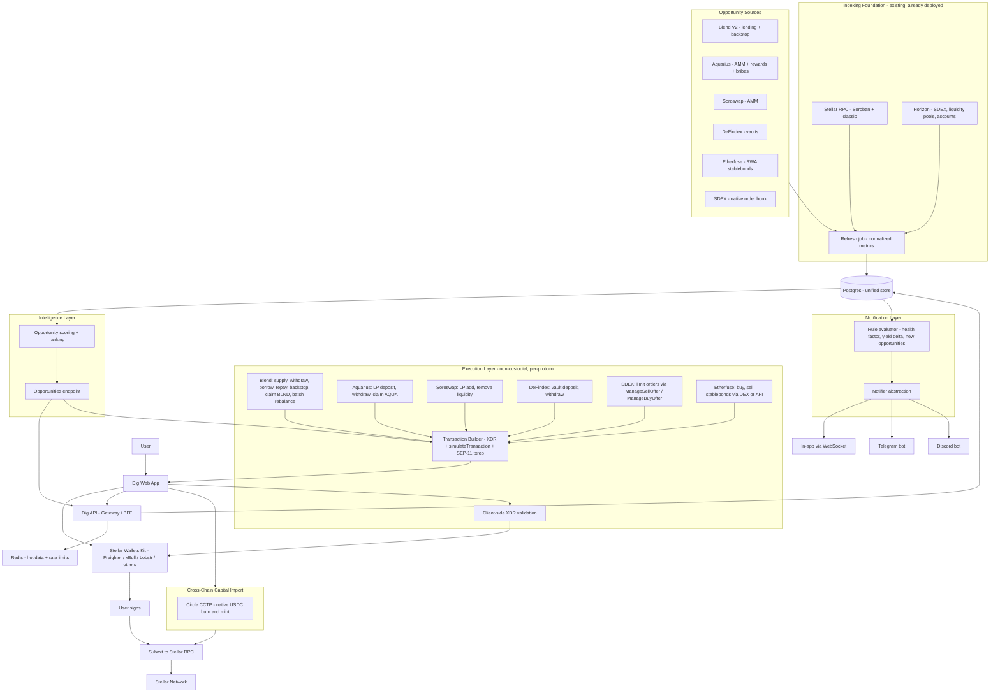
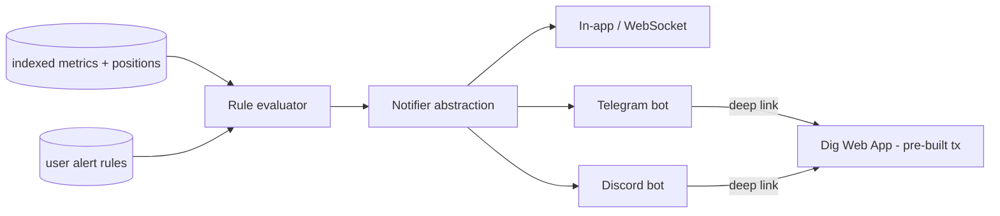

# Dig — Stellar DeFi Intelligence & Position Management Layer — Technical Architecture

This document is the technical architecture for Dig's accelerator-scope product: a DeFi intelligence and position management layer for Stellar. It is self-contained, Stellar-specific throughout, and focuses on the new capabilities built on top of the existing indexing and analytics infrastructure. For the full reference implementation of the underlying pipeline, already built and deployed, see the repository's main `docs/TECHNICAL_ARCHITECTURE.md`.

---

## 1. Objectives

Dig is building the unified management layer for Stellar DeFi. Where existing tools stop at read-only analytics and per-protocol interfaces, this product lets an active DeFi user manage all positions, compare all yield sources, and act on every integrated protocol from a single interface.

- **Rank** — continuously score and compare yield opportunities across lending, AMM liquidity, yield vaults, and tokenized real-world assets, with risk signals and net-of-cost returns.
- **Manage** — provide deep position management on each protocol: backstop deposits, LP add/remove, reward claims, vault allocation, and health-factor monitoring.
- **Act** — execute protocol actions in one click (or one atomic batch where the protocol supports it), with the transaction built server-side and signed exclusively in the user's wallet.
- **Alert** — notify the user through Telegram and Discord when a position requires attention, with a direct link to the pre-built resolution action on Dig.
- **Bridge** — move native USDC from external chains into Stellar via Circle CCTP.

The product is non-custodial by construction: the backend stores only public addresses and user preferences, never holds private keys, and never signs on a user's behalf. Dig does not deploy its own Soroban contracts. Every on-chain action is a direct invocation of the integrated protocol's existing contracts.

---

## 2. Relationship to the Existing Infrastructure

This scope extends Dig's existing Stellar work, built in the same monorepo. The following layers already exist and are reused as the foundation — they are not rebuilt here:

- **Hybrid indexing pipeline** — a Horizon + Soroban RPC ingestion pipeline normalizing protocol data into a unified Postgres store, with a canonical refresh job producing latest per-pool and per-protocol metrics, reserve snapshots, and asset prices.
- **Protocol read adapters** — adapters for Blend (pool reserves, positions, events), Aquarius (pools, rewards), Soroswap (pairs, reserves, swap events), DeFindex (vaults, strategies), and SDEX (order book, trades). Each produces normalized metrics in the unified schema.
- **Grouped multi-wallet portfolio** — persistent grouping of multiple tracked addresses per user, with balance snapshots and per-wallet refresh.
- **Non-custodial transaction builder** — server-side construction of multi-operation XDR envelopes, `simulateTransaction` preflight for Soroban actions, client-side XDR validation, SEP-11 txrep rendering, and in-wallet signing via Stellar Wallets Kit.
- **In-app alerting** — event-stream and snapshot-delta rule evaluation, with in-app WebSocket delivery.

The new layers below — deep protocol execution, intelligence/ranking, Etherfuse RWA integration, cross-chain onboarding, and external notification delivery — are built on top of these.

---

## 3. System Architecture



---

## 4. Core Design Principles

- **Non-custodial by construction.** The backend stores only public addresses and preferences. Every action is a proposal: an XDR built server-side, validated client-side, and signed in the user's wallet. The backend never sees a private key and never submits an unapproved transaction.
- **No custom contracts.** Dig does not deploy Soroban contracts. Every on-chain action is a direct call to an existing protocol contract (Blend, Aquarius, Soroswap, DeFindex, SDEX, Etherfuse issuer, CCTP). This eliminates smart-contract risk attributable to Dig.
- **On-chain as source of truth.** Any metric that drives an opportunity ranking or an alert is derivable from on-chain state (Soroban contract reads, Horizon, Reflector oracle prices). Off-chain SDKs and APIs are used for metadata and convenience, never as the authoritative source.
- **Same contracts, better access.** Using Dig carries the same smart-contract risk as using each protocol's own frontend. The user calls the same contract functions with the same parameters. What Dig adds is aggregation, comparison, and pre-built transactions across protocols.
- **Standards-first execution.** Transaction handoff uses Stellar Wallets Kit and SEP-7 URIs; human-readable summaries use SEP-11 txrep. No custom signing flows where a Stellar standard exists.
- **Explicit about ledger semantics.** The design accounts for ~5-second ledger close, deterministic finality (no reorgs), Soroban resource fees and storage TTL/archival, and the Protocol 20 constraint on mixing classic and Soroban operations in a single envelope (see §7).

---

## 5. Stellar Building Blocks — Deep Integration Plan

This is the heart of the architecture. For each integrated protocol, the table below shows what the existing foundation already reads (grant scope) and what this accelerator scope adds in terms of execution and position management.

### 5.1 Blend V2 — From Analytics to Full Position Management

**Existing (read-only foundation):**
- Pool state via `get_reserve(asset)`: supplied, borrowed, rate model state
- User positions via `get_positions(user)`: collateral and liability per asset
- Real-time events via `getEvents`: `supply`, `withdraw`, `borrow`, `repay`, `liquidate`
- Derived: utilization, APY curves, health factor (computed from positions + Reflector prices using per-asset `c_factor` and `l_factor`)
- Basic execution: `submit()` with a single deposit or withdraw Request

**New (accelerator scope):**

| Capability | Contract surface | Detail |
|---|---|---|
| **Backstop deposit** | `backstop.deposit(env, from, pool_address, amount) → i128` | User deposits BLND-USDC Comet LP tokens into a pool's backstop fund. Returns the number of backstop shares minted. The backstop module distributes BLND emissions to depositors proportionally. |
| **Backstop withdrawal** | `backstop.queue_withdrawal(env, from, pool_address, amount) → Q4W` then `backstop.withdraw(env, from, pool_address, amount) → i128` | Withdrawal is not instant: the user first queues a withdrawal (q4w mechanism), then withdraws after the queue period. `dequeue_withdrawal()` cancels a queued withdrawal. Dig's UI manages the full cycle and shows the queue countdown. |
| **Claim BLND emissions** | `backstop.claim(env, from, pool_addresses: Vec<Address>, to: Address) → i128` | Claims accumulated BLND across one or multiple pools in a single call. `pool_addresses` is a vector, so one transaction covers all pools. Returns total BLND claimed. |
| **Health factor actions** | `pool.submit(from, spender, to, requests: Vec<Request>)` with `Request { request_type: 2 (DepositCollateral), address, amount }` or `Request { request_type: 5 (Repay), address, amount }` | When the notification layer detects a health factor drop, Dig pre-builds the resolution transaction (add collateral or partial repay) and links to it from the alert. |
| **Batch rebalance** | `pool.submit(from, spender, to, requests: Vec<Request>)` with multiple Requests of different types | Blend's `submit()` accepts a `Vec<Request>` with mixed types (0=Deposit, 1=Withdraw, 2=DepositCollateral, 3=WithdrawCollateral, 4=Borrow, 5=Repay). All operations execute atomically in one Soroban invocation; the entire call reverts if the resulting position is unhealthy. Dig surfaces rebalance scenarios (e.g., "withdraw collateral A + deposit collateral B") as one-click actions. |
| **Backstop vs supply comparison** | Intelligence layer | The scoring engine compares backstop yield (BLND emissions, q4w risk, loss-absorption exposure) against direct supply yield (interest APY) for the same pool, so the user can choose. |

**Blend SDK reference:** `@blend-capital/blend-sdk` — modules `pool` (PoolContract, RequestType, Positions) and `backstop` (BackstopClient, UserBalance, Q4W).

### 5.2 Aquarius — LP Management, Reward Claims, and Analytics

**Existing (read-only foundation):**
- Pool state via Soroban contract reads and classic `/liquidity_pools` (Horizon)
- AQUA emissions per pool from `liquidity_pool_reward_gauge`
- Derived: TVL, volume, effective APR including emissions

**New (accelerator scope):**

| Capability | Contract surface | Detail |
|---|---|---|
| **LP deposit** | `liquidity_pool.deposit(env, user, tokens: Vec<Address>, pool_index: BytesN<32>, desired_amounts: Vec<u128>, min_shares: u128) → (Vec<u128>, u128)` | User provides liquidity to an Aquarius pool (volatile, stableswap, or concentrated). Returns actual amounts deposited and shares minted. Note: Aquarius uses `u128` (unsigned), unlike Blend/Soroswap which use `i128`. |
| **LP withdraw** | `liquidity_pool.withdraw(env, user, tokens: Vec<Address>, pool_index: BytesN<32>, share_amount: u128, min_amounts: Vec<u128>) → Vec<u128>` | Burns LP shares and returns underlying tokens. `min_amounts` protects against slippage. |
| **Claim AQUA rewards** | `pool_contract.claim(user_address) → u128` | Claims accumulated AQUA emissions for the user's LP position. Called on the pool contract address directly. Rewards accrue per second. Returns amount claimed (divide by 10^7 for AQUA). |
| **Impermanent loss tracking** | Computed by Dig, not a contract call | For each LP position, Dig computes: (a) current position value from pool reserves and Reflector prices, (b) hold-equivalent value from entry amounts at current prices, (c) net P&L = fees earned + AQUA rewards - impermanent loss. Requires historical entry data from indexed deposit events. |
| **Bribing visibility** | Aquarius Bribes API: `GET bribes-api.aqua.network/api/bribes/` + Market Keys API: `GET marketkeys-tracker.aqua.network/api/market-keys/` | Aquarius exposes a public REST API returning active bribes per market: `market_key`, `total_reward_amount`, `daily_amount`, `start_at/stop_at` (weekly periods), and AQUA equivalent. Cross-referencing with the Market Keys API resolves each `market_key` to its asset pair. Dig reads both APIs to compute bribe APR per pool (daily_amount x AQUA price / pool TVL) and integrates it into the opportunity score. 18 active bribe markets as of June 2026. |

**Pool types:** Aquarius operates three pool types on Soroban — volatile (xy=k), stableswap (optimized for correlated assets), and concentrated liquidity (tick ranges). The adapter handles all three; the `pool_index: BytesN<32>` parameter identifies each pool uniquely.

### 5.3 Soroswap — LP Management via Router

**Existing (read-only foundation):**
- Factory enumeration, pair reserves, swap events, Router quote generation
- Swap execution via Router `swap_exact_tokens_for_tokens()`

**New (accelerator scope):**

| Capability | Contract surface | Detail |
|---|---|---|
| **Add liquidity** | `Router.add_liquidity(env, token_a, token_b, amount_a_desired: i128, amount_b_desired: i128, amount_a_min: i128, amount_b_min: i128, to: Address, deadline: u64) → (i128, i128, i128)` | Adds liquidity to a Soroswap pair via the Router. Returns `(amount_a_actual, amount_b_actual, liquidity_minted)`. The Router calculates the optimal ratio. `deadline` is a Unix timestamp after which the transaction fails. |
| **Remove liquidity** | `Router.remove_liquidity(env, token_a, token_b, liquidity: i128, amount_a_min: i128, amount_b_min: i128, to: Address, deadline: u64) → (i128, i128)` | Burns LP tokens and returns the underlying pair. `liquidity` is the amount of LP tokens to burn. |

**Cross-DEX context:** Dig already reads quotes from the Soroswap Aggregator (which routes across Soroswap, Aquarius, and SDEX). The LP management added here lets users not just swap but also provide and withdraw liquidity, completing the AMM interaction surface.

### 5.4 DeFindex — Vault Interaction and Strategy Transparency

**Existing (read-only foundation):**
- Vault state: `total_assets()`, `total_supply()`, `balance_of(user)`
- Strategy reads: underlying exposure decomposition
- Derived: share-to-asset ratio over time, vault APY

**New (accelerator scope):**

| Capability | Contract surface | Detail |
|---|---|---|
| **Vault deposit** | `vault.deposit(amounts_desired: Vec<i128>, amounts_min: Vec<i128>, from: Address, invest: bool) → (Vec<i128>, i128, Option<...>)` | Deposits assets into a DeFindex vault. When `invest=true`, funds are immediately allocated to the vault's strategies. Returns actual amounts deposited and dfTokens minted. Minimum first deposit: 1001 units (anti-inflation-attack protection). |
| **Vault withdraw** | `vault.withdraw(withdraw_shares: i128, min_amounts_out: Vec<i128>, from: Address) → Vec<i128>` | Burns dfTokens and returns the underlying assets. `withdraw_shares` is in dfToken units, not asset units. |
| **Strategy comparison** | Dig reads `balance()` on each strategy contract, plus vault composition from the Factory | Dig shows which strategies a vault uses (e.g., BlendStrategy, HodlStrategy, FixedAPRStrategy), how capital is allocated across them, and historical performance per strategy. Users compare vaults side by side. |

**Mainnet vaults (as of Q2 2026):** Fixed Pool (USDC, EURC, XLM), YieldBlox Pool (USDC, EURC, XLM, CETES, USTRY, AQUA, USDGLO), Orbit Pool (XLM, CETES, USTRY, oUSD). All on Blend autocompound strategies.

**SDK:** `@defindex/sdk` — `depositToVault()`, `withdrawFromVault()`, `getUserShares()`.

### 5.5 Etherfuse — Real-World Asset Yield (new integration)

**What it is:** Etherfuse issues tokenized sovereign bonds (Stablebonds) on Stellar as classic assets with trustlines. These carry real yield backed by government bonds, not token emissions.

**On-chain verification (Horizon, June 2026):**

| Asset | Code | Issuer | Holders | Supply | Liquidity pools | Soroban contracts |
|---|---|---|---|---|---|---|
| Mexican CETES | `CETES` | `GCRYUGD5...` | 908 | ~$49.8M | 61 | 20 (incl. DeFindex) |
| US Treasury | `USTRY` | `GCRYUGD5...` | 659 | ~$10.4M | 35 | 30 |
| European Bonds | `EUROB` | `GCRYUGD5...` | 25 | small | — | — |
| Brazilian Tesouro | `TESOURO` | `GCRYUGD5...` | — | — | — | — |
| Korean KTB | `KTB` | `GCRYUGD5...` | — | — | — | — |

All issued by `GCRYUGD5NVARGXT56XEZI5CIFCQETYHAPQQTHO2O3IQZTHDH4LATMYWC` (Etherfuse official issuer, confirmed via `etherfuse.com/.well-known/stellar.toml`, status: "live"). SAC contract IDs available for Soroban interop (e.g., USTRY: `CBLV4ATSIWU67CFSQU2NVRKINQIKUZ2ODSZBUJTJ43VJVRSBTZYOPNUR`, CETES: `CAL6ER2TI6CTRAY6BFXWNWA7WTYXUXTQCHUBCIBU5O6KM3HJFG6Z6VXV`).

**KYC model:** Deferred KYC — no KYC required to buy stablebonds with USDC. KYC is required only when redeeming to fiat. Geographic restriction: not available to US residents (standard for tokenized US treasuries).

**Integration path:**

| Capability | Path | Detail |
|---|---|---|
| **Indexing** | New adapter: read trustline balances, DEX pool reserves, price via Reflector or DEX midpoint | Stablebonds are tracked as a new opportunity category (`rwa_yield`) in the unified schema. Yield is derived from price appreciation over time (the token accrues interest). |
| **Buy via DEX** | `PathPaymentStrictSend` or `ManageBuyOffer` on the SDEX / classic liquidity pools | CETES and USTRY are tradable on 61 and 35 liquidity pools respectively. Dig builds a swap transaction from USDC to the target stablebond. Standard classic multi-op envelope (can bundle `ChangeTrust` if needed). |
| **Buy via Etherfuse API** | `POST /ramp/quote` → `POST /ramp/swap` | For direct issuance at par rather than market price. Asset identifiers fetched from `GET /ramp/assets?blockchain=stellar`. |
| **Portfolio tracking** | Existing `user_wallets` + trustline balance reads | Stablebond positions appear alongside DeFi positions in the consolidated portfolio. |

### 5.6 SDEX — Native Order Book (deepened)

**Existing (read-only foundation):**
- Order book reads via Horizon `/order_book`
- Trade history via `/trades`
- Swap execution via `PathPaymentStrictSend` / `PathPaymentStrictReceive`

**New (accelerator scope):**

| Capability | Operation | Detail |
|---|---|---|
| **Limit orders** | `ManageSellOffer(selling, buying, amount, price, offerId=0)` or `ManageBuyOffer(...)` | Place limit orders on the SDEX — a native Stellar feature no other L1 has in-protocol. This is a classic operation, so it can be bundled atomically with `ChangeTrust` and other classic ops in a single envelope. |
| **Order management** | `ManageSellOffer(..., offerId=existing)` with amount=0 to cancel | View, modify, and cancel open orders from the Dig portfolio. |

### 5.7 Circle CCTP — Cross-Chain USDC Import (new integration)

CCTP moves native USDC across chains by burning on the source chain and minting on the destination, with no wrapped assets and no third-party liquidity pool. V2 is live on Stellar mainnet since May 2026.

**Stellar contracts (deployed by Circle, not Dig):**
- **MessageTransmitter** — core messaging: emits, receives, and validates cross-chain messages with Circle attestations.
- **CctpForwarder** — calls `receive_message` on MessageTransmitter, takes the mint, and transfers USDC to the `forwardRecipient` in a single atomic Soroban invocation (non-custodial).

**Dig's flow:**

1. The user selects a source chain and connects a source-chain wallet (their own EVM/Solana wallet).
2. Dig builds the burn transaction on the source chain. The user signs with their source-chain wallet.
3. Dig polls for Circle's attestation.
4. Once attested, Dig builds the mint transaction on Stellar (invoking the MessageTransmitter contract). The user signs with their Stellar wallet.
5. USDC arrives in the user's Stellar account. Optionally, a follow-up transaction deploys it into a surfaced opportunity.

Dig does not deploy any contract. The orchestration is frontend/backend only.

---

## 6. Execution Model

### 6.1 Action from Opportunity or Portfolio

Each ranked opportunity (and each existing position in the portfolio) carries enough metadata for the transaction builder to construct the appropriate protocol action. The flow:

1. The user selects an action (deposit, withdraw, claim, rebalance, buy stablebond, place limit order, bridge USDC) and a source account.
2. The API reads the user's current state (trustlines, balances, positions) via `loadAccount` and indexed data.
3. The API builds the transaction proposal:
   - For Soroban actions: a single `InvokeHostFunction` calling the protocol's contract, preflighted via `simulateTransaction`. The returned footprint, resource fees, and auth entries are attached. If a persistent entry's TTL has expired, `restore_footprint` is bundled.
   - For classic actions (SDEX limit orders, stablebond swaps via PathPayment): a multi-operation XDR that can bundle `ChangeTrust` + the action atomically.
4. The frontend re-decodes the XDR, validates it matches the declared intent, and renders a SEP-11 txrep summary plus fee breakdown.
5. The user signs in-wallet via Stellar Wallets Kit. The frontend submits to Stellar RPC `sendTransaction` and polls `getTransaction`.
6. On success, the portfolio updates optimistically; the authoritative update follows from the indexing layer within one ledger close.

### 6.2 Protocol 20 Constraint

Stellar Protocol 20 forbids mixing `InvokeHostFunction` (Soroban) with classic operations in a single transaction envelope:

- **Classic actions (SDEX swap, limit order, stablebond buy via PathPayment):** can bundle `ChangeTrust` + the action in one atomic envelope. This is the canonical bundling case.
- **Soroban actions (Blend submit, Aquarius deposit, Soroswap add_liquidity, DeFindex deposit):** cannot include a classic `ChangeTrust` in the same envelope. Where a trustline prerequisite exists, it is handled as a separate preceding transaction, then the Soroban invocation follows. The UX abstracts this as a guided two-step sequence.
- **Blend batch rebalance:** multiple Request types within a single `submit()` call are inherently atomic. This is not constrained by Protocol 20 because it is one Soroban invocation, not multiple.

### 6.3 Cross-Pool and Cross-Protocol Sequences

Moving a position from one protocol to another (e.g., withdraw from Blend Pool A → deposit into DeFindex vault) requires multiple separate transactions since each targets a different Soroban contract. Dig handles these as a **guided multi-step sequence**: transactions are pre-built in order, presented to the user as a plan ("Step 1/2: withdraw from Blend, Step 2/2: deposit into DeFindex"), and executed sequentially with signing at each step. This is not atomic across protocols, but each individual step is atomic within its protocol. If a step fails, the user's funds remain in their wallet and the remaining steps can be retried.

### 6.4 Fees and Authorization

- **Classic inclusion fees:** default to 1000 stroops per operation, adjustable.
- **Soroban resource fees:** derived from `simulateTransaction.minResourceFee` plus a configurable safety margin (default 50%).
- **Soroban authorization:** for most actions the user is the sole invoker (`InvokerContractAuthEntry` attached by the SDK). Cross-contract auth chains (e.g., a DeFindex vault authorizing an underlying strategy withdrawal) are taken from the full auth array returned by simulation.

---

## 7. Intelligence Layer

The intelligence layer turns normalized protocol data into ranked, comparable opportunities. It runs over the data already produced by the indexing pipeline and the new adapters (Etherfuse, backstop) rather than calling protocols live.

### 7.1 Opportunity Categories

| Category | Sources | Yield derivation | Risk signals |
|---|---|---|---|
| **Lending supply** | Blend pools | Interest APY from rate model | Utilization, pool TVL volatility, oracle dependency |
| **Lending borrow** | Blend pools | Negative (cost), but shows savings vs alternative pools | Health factor pressure, liquidation distance |
| **Backstop insurance** | Blend backstop | BLND emission APR, proportional to backstop shares | Loss-absorption exposure, q4w lock period, BLND price volatility |
| **AMM liquidity** | Aquarius, Soroswap | Fee APR + emission APR (AQUA) + bribe APR - estimated impermanent loss | IL magnitude, pool concentration, asset correlation |
| **Yield vaults** | DeFindex | Share-to-asset ratio growth over time (auto-compound APY) | Underlying strategy risk, vault TVL, smart-contract layers |
| **RWA / real yield** | Etherfuse stablebonds | Price appreciation = accrued bond interest | Sovereign credit risk, custody risk, liquidity (pool depth on DEX) |
| **SDEX limit orders** | SDEX order book | Not scored as yield; surfaced as an action capability | — |

### 7.2 Scoring

For each opportunity the engine computes:

- A **yield estimate** (APY/APR, net of impermanent loss for LPs, net of emission token price risk where applicable).
- One or more **risk signals** per category (see table above).
- A **composite ranking score** combining yield, risk, and ecosystem relevance.

### 7.3 Cross-Category Comparison

The key differentiator is the ability to compare across categories: a user sees "Blend USDC supply 7% (DeFi protocol risk)" alongside "Aquarius XLM-USDC LP 12% (IL risk, offset by AQUA emissions)" alongside "Etherfuse USTRY 5% (US sovereign credit risk)" alongside "DeFindex USDC vault 6.5% (auto-compound, no management)". Each with a different risk profile. This comparison is what makes the ranking actionable rather than decorative.

### 7.4 Output

Ranked opportunities are served through `/v1/opportunities`, consumed by the dashboard and the notification evaluator. Each opportunity exposes its metrics, risk signals, and the metadata the execution layer needs to build the underlying action.

---

## 8. Notification Layer

The notification layer extends the existing in-app alerting with external delivery via Telegram and Discord bots. The bot does not allow signing — it alerts and links to Dig on desktop where the wallet is connected and the action is pre-built.

### 8.1 Architecture



### 8.2 Alert Types

| Alert type | Trigger | Action linked |
|---|---|---|
| **Health factor critical** | User's Blend health factor drops below configured threshold (default: 1.2) | Link to Dig with pre-built `submit([DepositCollateral])` or `submit([Repay])` transaction |
| **Yield change** | A pool/vault APY changes by more than a configured delta (e.g., ±30% relative) | Link to the opportunity detail with current vs previous yield |
| **New high-rank opportunity** | The intelligence engine surfaces a new opportunity above the user's configured score threshold | Link to the opportunity with action button |
| **Bribe activated** | A new bribe is detected on a pool where the user has LP | Link to the pool detail with updated APR breakdown |
| **Backstop q4w ready** | A queued backstop withdrawal has passed the unlock period | Link to Dig with pre-built `backstop.withdraw()` transaction |

### 8.3 Rule Model

Users configure alert preferences server-side: which alert types, which thresholds, which channels (in-app, Telegram, Discord, or any combination), and per-rule cooldowns to prevent alert fatigue.

### 8.4 Delivery

The `Notifier` is a channel-agnostic interface. Adding a new channel means implementing the delivery adapter without touching the evaluator. Missed alerts (user offline for in-app) are queued and delivered on next session open.

---

## 9. Data Model Additions

The new layers extend the existing unified store, following the same conventions (snake_case raw SQL, `*_latest` upsert pattern, explicit freshness columns).

```
opportunities_latest          -- ranked output of the intelligence engine
  id, venue_id, entity_id
  opportunity_type            -- lending_supply, lending_borrow, backstop, amm_lp,
                              -- vault_deposit, rwa_yield, sdex_pair
  yield_estimate_apy
  risk_score
  ranking_score
  il_estimate                 -- impermanent loss estimate (AMM only, nullable)
  bribe_apr                   -- bribe yield (Aquarius only, nullable)
  as_of                       -- freshness
  metadata                    -- signal breakdown, source attribution

backstop_positions            -- user backstop deposits (Blend)
  id, user_id, pool_address
  shares, deposit_amount
  pending_q4w_amount, q4w_exp -- queue-for-withdrawal state
  claimable_blnd              -- unclaimed BLND emissions
  as_of

lp_positions                  -- user LP positions (Aquarius + Soroswap)
  id, user_id, venue_id, protocol
  shares, entry_amounts       -- amounts at deposit time (for IL calc)
  entry_prices                -- Reflector prices at deposit time
  current_value_usd
  il_usd                      -- computed impermanent loss
  rewards_claimable           -- unclaimed AQUA (Aquarius)
  as_of

rwa_positions                 -- user stablebond holdings (Etherfuse)
  id, user_id
  asset_code, asset_issuer
  balance, entry_price
  current_price, accrued_yield_usd
  as_of

alert_rules                   -- user-defined alert configuration
  id, user_id
  alert_type                  -- health_factor, yield_delta, new_opportunity, bribe, q4w_ready
  scope, scope_ref            -- protocol / venue / wallet / global
  threshold, cooldown
  channels                    -- array: [in_app, telegram, discord]

alerts                        -- generated notifications
  id, rule_id, triggered_at
  context                     -- values at trigger time
  deep_link                   -- URL to Dig with pre-built action
  delivered_channels, acknowledged_at

bridge_transfers              -- CCTP transfers in flight
  id, user_id
  source_chain, source_tx
  dest_account
  amount, status
  attestation_hash
  created_at, updated_at
```

Soroban i128 balances continue to be stored as strings with USD values computed at ingest using Reflector oracle prices.

---

## 10. Security & Non-Custodial Model

| Threat | Mitigation |
|---|---|
| Backend crafts a malicious XDR | Client-side operation-by-operation XDR decoding; SEP-11 txrep shown before signing; user-configurable spend limits enforced client-side |
| Compromised frontend (XSS) | Strict CSP, no third-party scripts in signing flows, subresource integrity |
| Cross-chain transfer routed to wrong destination | Destination Stellar address is bound to the authenticated user; bridge proposals validated client-side |
| Stale indexed data drives a bad action | On-chain re-read at build time (`loadAccount`, `simulateTransaction`); freshness surfaced in UI; anomaly checks on metric jumps |
| Impermanent loss miscalculation | IL is informational (displayed in portfolio), never used to gate an action. Entry data is sourced from indexed deposit events, not user input. |

**Key invariants.** The backend never stores private keys or secret seeds. Every XDR sent for signing is structurally validated client-side against the declared intent. No watch-only address is usable for signing without an explicit wallet connection. Logs exclude PII and raw account addresses beyond hashed identifiers.

---

## 11. Deployment & Operations

The product extends the existing deployment shape: the web app on a CDN/Vercel, the API on a controllable server runtime, and the indexer/jobs (refresh, intelligence scoring, alert evaluation, notification delivery) on a scheduled runtime.

**Telegram/Discord bots** are long-running processes deployed alongside the API, consuming the notification queue. They maintain per-user session state (channel preferences, linked Dig account) stored in the same Postgres instance.

**RPC provider:** For Mainnet, a paid Stellar RPC provider with a failover endpoint, abstracted behind the RPC client.

**Observability:** Per-source data-freshness state surfaced in the UI, failing sources retried with exponential backoff, `/health` endpoint, RPC latency metrics, alert delivery success rate.

---

## 12. Scope Boundaries

**In scope:** deep execution on Blend (backstop, claim, health-factor management, batch rebalance), LP management on Aquarius and Soroswap, vault interaction on DeFindex, SDEX limit orders, Etherfuse stablebond integration (indexing + buy/sell), CCTP cross-chain USDC import, intelligence engine with cross-category comparison, and Telegram/Discord notification bots, culminating in a Mainnet launch.

**Out of scope:** custom Soroban contracts deployed by Dig; mobile app; fiat on-ramp; social login / embedded wallets (Privy, passkey); cross-chain rails beyond CCTP (Allbridge, Axelar, Near Intents); automated execution without user signature; Aquarius governance voting.
