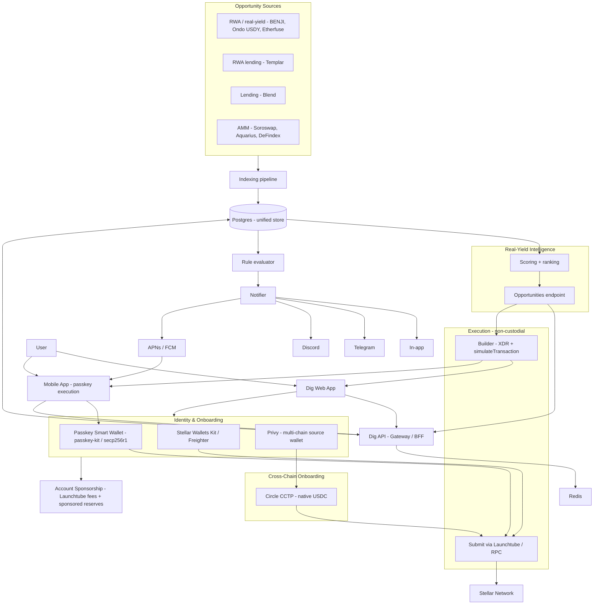
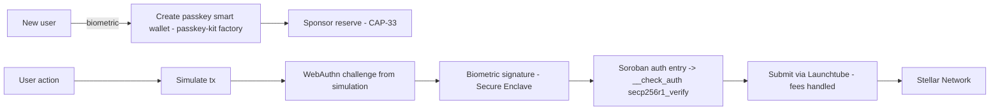
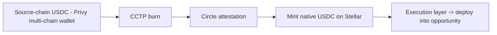

# Dig — Stellar Real-Yield Intelligence & Execution Gateway — Technical Architecture

This document is the technical architecture for Dig's accelerator-scope product: a real-yield
intelligence and execution gateway for Stellar DeFi. It is self-contained and Stellar-specific
throughout, and for the integration track it details exactly how each Stellar building block is
integrated. The underlying indexing and analytics infrastructure (delivered under SCF 43) is
documented in the repository's main `docs/TECHNICAL_ARCHITECTURE.md`; this document restates what
it depends on and focuses on the new layers.

A reviewer-oriented FAQ anticipating the most likely Stellar-specific questions is in §15.

---

## 1. Objectives

Dig is building the simplest way for a crypto user to discover and act on Stellar's real-yield
economy. Stellar's center of gravity is real-world assets and real yield — tokenized treasuries,
money-market funds, and RWA-collateralized lending now represent the majority of on-chain value on
the network — and that is where this product focuses.

- **Discover** — surface and rank the ecosystem's real-yield and RWA opportunities, explained.
- **Onboard** — give every user a Stellar-native, passkey-based smart wallet: biometric signing,
  no seed phrase, and account sponsorship so a user with no XLM is operational immediately.
- **Act** — execute the on-chain action behind an opportunity in one click, on web and mobile,
  with the transaction signed exclusively in the user's wallet.
- **Bring capital in** — move native USDC from other chains into Stellar (CCTP) and let users
  on-ramp from fiat through a partner, then deploy directly into an opportunity.

The product is non-custodial by construction: the backend stores only public addresses and
preferences, and never holds a private key or signs on a user's behalf.

> Fiat onboarding is in scope through a third-party provider (a SEP-24 anchor or an on-ramp
> widget): the regulatory burden (KYC, AML, licensing) is carried by the provider, and Dig
> integrates as a client. Becoming an anchor ourselves is explicitly excluded. Coverage is
> therefore provider-dependent by region, which the product communicates honestly.

---

## 2. Relationship to the Existing Infrastructure

This scope extends Dig's existing Stellar work, in the same monorepo. The following already exist
and are reused as the foundation, not rebuilt:

- **Hybrid indexing pipeline** — Horizon + Soroban RPC ingestion normalizing protocol data into a
  unified Postgres store, with a canonical refresh job producing latest per-pool / per-protocol
  metrics, reserve snapshots, and asset prices.
- **Protocol analytics API** — internal endpoints serving live Mainnet metrics for the integrated
  protocols.
- **Grouped multi-wallet portfolio** — persistent per-user grouping of tracked addresses with
  balance snapshots.
- **Non-custodial transaction builder** — server-side construction of multi-operation XDR, client-
  side validation, and in-wallet signing via Stellar Wallets Kit, proven end-to-end on Testnet.

The new layers — real-yield/RWA intelligence, passkey onboarding with sponsorship, one-click
execution, cross-chain onboarding, notifications, and mobile execution — build on these.

---

## 3. System Architecture



---

## 4. Core Design Principles

- **Non-custodial by construction.** Every action is a proposal: an XDR built server-side,
  validated client-side, signed in the user's wallet. With passkey smart wallets the signing key
  never leaves the device's secure hardware. The backend never sees a key and never submits an
  unapproved transaction. Account sponsorship does not equal custody (see §13).
- **Real-yield first.** The opportunity model treats RWA and real yield as the primary category,
  reflecting where Stellar's value and SDF's roadmap actually are.
- **Stellar-native identity.** Onboarding defaults to passkey smart wallets (secp256r1 / Protocol
  21), the identity primitive Stellar built for mainstream UX, rather than a generic EOA layer.
- **On-chain as source of truth.** Any metric driving a ranking or alert is derivable from on-chain
  state (Soroban reads, Horizon, Reflector oracle prices).
- **Reuse over reinvention.** Built on the existing indexing pipeline, transaction builder, and
  multi-wallet model.
- **Explicit about ledger semantics.** ~5s ledger close, deterministic finality (no reorgs),
  Soroban resource fees and storage TTL/archival, and the Protocol 20 constraint on mixing classic
  and Soroban operations in one envelope (see §7).

---

## 5. Stellar Building Blocks — Integration Plan

Two families: **opportunity sources** that feed the intelligence layer (real-yield / RWA first),
and **identity, execution & onboarding rails** that enable action.

### 5.1 Opportunity Sources (real-yield / RWA first-class)

| Source | Category | Read path | Signals |
|---|---|---|---|
| **Tokenized treasuries / MMFs** (e.g., Franklin Templeton BENJI, Ondo USDY) | RWA real-yield | Issued Stellar assets / SAC; balances and transfers via Horizon + Soroban; yield from issuer reference data reconciled with on-chain state | Real APY, issuer/counterparty profile, redemption terms, transfer restrictions |
| **Etherfuse Stablebonds** (e.g., CETES, USTRY) | RWA real-yield | Stablebond assets on Stellar, read via trustline/SAC state and DEX/market data | Sovereign-bond yield, jurisdiction, liquidity |
| **Templar** | RWA-collateralized lending | Soroban contract reads on lending markets backed by freely-transferable RWAs | Borrow/supply rates, RWA collateral composition, utilization |
| **Blend** | Lending | Soroban: `get_reserve`, `get_positions`; lending events | Supply/borrow APY, utilization, health-factor risk |
| **Soroswap / Aquarius / DeFindex** | AMM / vaults (secondary) | Soroban reads + `getEvents`; classic `/liquidity_pools` for Aquarius | Pool TVL, volume, fee/emission APR, vault share-ratio APY |

USD values are computed at ingest using Reflector oracle prices. The intelligence layer (§9)
ranks across categories with real-yield surfaced first.

### 5.2 Identity, Execution & Onboarding Rails

| Rail | Provides | Integration path |
|---|---|---|
| **Passkey smart wallets** (passkey-kit) | Primary Stellar identity: biometric signing, no seed, account abstraction | factory + wallet contracts from passkey-kit; secp256r1 verification on-chain (CAP-51); see §6 |
| **Launchtube** | Soroban transaction submission with fee + sequence handling | Submission path for passkey-wallet transactions; the basis of fee sponsorship (§6) |
| **Sponsored reserves (CAP-33)** | Account reserve coverage for users with no XLM | Dig sponsors the account reserve so a new user is operational immediately (§6) |
| **Stellar Wallets Kit + Freighter** | In-wallet signing for crypto-native users | Already integrated; signs builder-produced XDR |
| **Privy** | Multi-chain source wallet (EVM / Solana / Stellar) | Used specifically to hold the source-chain wallet in the CCTP flow (§8) |
| **Circle CCTP** | Native USDC cross-chain transfer (burn-and-mint) | Burn on source, Circle attestation, mint on Stellar, route into an opportunity (§8) |
| **Fiat on-ramp** (SEP-24 anchor / third-party widget) | Fiat → USDC onto the user's Stellar wallet | Dig integrates as a client (SEP-24 hosted flow, or a provider widget); KYC/AML/licensing carried by the provider (§8) |

> **Allbridge Core** is tracked as a stretch extension for broader stablecoin / source-chain
> coverage; it is not a core deliverable in this scope.

---

## 6. Identity & Onboarding — Passkey Smart Wallets

Onboarding is the top of the funnel and the main adoption barrier. The default path is a
Stellar-native passkey smart wallet; Wallets Kit remains for crypto-native users.

### 6.1 Passkey smart wallet

A passkey smart wallet is a Soroban **contract account** whose authorization is a WebAuthn passkey
signature verified on-chain. The key material is generated and held inside the device's secure
hardware (Secure Enclave / TPM) and is never exposed to the user, the browser, or Dig's backend.

- **Cryptography.** Protocol 21 (CAP-51) enables native secp256r1 verification in Soroban, so a
  contract can verify a WebAuthn/passkey signature on-chain (`secp256r1_verify`).
- **Contracts.** Dig uses passkey-kit's factory and wallet contracts rather than authoring its own
  Soroban contracts. A factory deploys and initializes each user's wallet contract atomically.
- **Authorization.** For each action, the WebAuthn challenge is derived from the transaction's
  simulation (binding the biometric signature to the exact transaction), attached as a Soroban
  authorization entry, and verified by the wallet contract's `__check_auth`.
- **Account abstraction.** The model supports multiple signers, policy signers, and recovery. The
  initial scope targets single-passkey wallets with a recovery path; richer policy signing is a
  natural extension.

### 6.2 Account sponsorship (users with no XLM)

A web2-onboarded user holds no XLM and can neither pay fees nor meet the account reserve. Both are
sponsored:

- **Fees.** Soroban transactions are submitted through **Launchtube**, which handles inclusion and
  resource fees and sequence numbering — fee abstraction without Dig holding user keys.
- **Reserve.** Dig sponsors the account's base/subentry reserve via **sponsored reserves (CAP-33)**,
  so account creation and trustlines do not require the user to fund anything.

Sponsorship is an economic commitment, not a custodial one: a sponsor covers a reserve and may
reclaim it, but cannot move the user's funds (see §13). The cost is a recoverable XLM reserve
provisioned per onboarded account plus negligible per-transaction fees.

### 6.3 Wallet model

All wallet types are tracked together in the consolidated portfolio (the existing `user_wallets`
model with a provider qualifier). A watch-only address stays read-only and cannot enter a signing
context without an explicit connection.



---

## 7. Execution Model

### 7.1 One-click action from an opportunity

1. The user selects an opportunity and source account (passkey wallet or connected wallet).
2. The API builds the proposal server-side from indexed state plus a live account read, bundling
   prerequisites (e.g., a missing `ChangeTrust`) where the protocol allows it in one envelope.
3. Soroban actions are preflighted via `simulateTransaction`; footprint, resource fees, and auth
   entries are attached, with `restore_footprint` bundled if a persistent entry's TTL has expired.
4. The frontend re-decodes and validates the XDR against the declared intent and shows a SEP-11
   txrep summary plus fee breakdown.
5. The user signs — biometrically for a passkey wallet (§6), or in-wallet via Wallets Kit — and the
   transaction is submitted (Launchtube for passkey-wallet Soroban transactions, RPC otherwise).
6. On success, the portfolio updates optimistically; the authoritative update follows from indexing.

### 7.2 Protocol 20 constraint (decided)

Protocol 20 forbids mixing `InvokeHostFunction` (Soroban) with classic operations in one envelope:

- **Classic actions (e.g., an SDEX swap)** are a single multi-operation XDR (e.g., `ChangeTrust` +
  `PathPaymentStrictSend`).
- **Soroban actions (e.g., a Blend/Templar/DeFindex deposit)** are authorized through the contract
  account. Any classic prerequisite (e.g., a trustline) is a preceding transaction; the one-click
  UX abstracts this as a guided sequence, and the non-custodial guarantee holds at every step.

For passkey smart wallets, the wallet contract's `__check_auth` authorizes the Soroban invocation,
which is a cleaner authorization model for contract-account-driven actions than raw EOA signing.

---

## 8. Capital Onboarding — Crypto & Fiat

Users bring capital into Stellar through two paths that converge on the same destination: USDC on
the user's Stellar wallet, ready to deploy into an opportunity.

### 8.1 Crypto — Circle CCTP

Native USDC is brought into Stellar via **Circle CCTP**: burn on the source chain, Circle
attestation, mint on Stellar, then route the minted USDC into an opportunity through the execution
layer. CCTP is burn-and-mint with no wrapped assets and no third-party liquidity pool.

**Privy's role.** Privy provisions a multi-chain wallet (EVM / Solana / Stellar) from one user
identity, so the source-chain burn and the Stellar-side receipt happen under a single session. This
is the specific, bounded reason Privy is in the stack — not as the Stellar identity layer, which is
the passkey smart wallet (§6).



Allbridge Core (broader stablecoin / source-chain coverage) is a stretch extension, not budgeted
as a core deliverable.

### 8.2 Fiat — partner on-ramp

For users without crypto elsewhere, fiat onboarding is provided by consuming a third-party
provider rather than building one. Two integration shapes are supported by the ecosystem: a SEP-24
hosted deposit flow against a Stellar anchor (the user completes payment and KYC in the anchor's
hosted webview; Dig implements only the SEP-10 + SEP-24 client and does not handle KYC), or an
on-ramp widget/API (e.g., a provider supporting Stellar USDC) that delivers USDC to the user's
Stellar address. In both cases the provider carries KYC, AML, and licensing; Dig is a client.

The delivered USDC lands on the user's passkey smart wallet (§6) and flows into the same execution
path as crypto-onboarded capital. Two honest constraints are carried into the UI: coverage is
provider-dependent by region, and going live with some providers requires a partner onboarding
step (e.g., wallet-domain allowlisting / KYB), which is a lead-time dependency rather than a
code dependency. Provider selection is de-risked by a discovery spike before commitment.

---

## 9. Real-Yield Intelligence Layer

The intelligence layer turns normalized data into ranked, explained opportunities, with real-yield
and RWA first. It runs over indexed data rather than calling protocols live.

**Inputs.** Latest per-source metrics, snapshots, normalized events, asset prices, plus adapters
for the real-yield sources (§5.1).

**Scoring.** Per opportunity:

- a **yield estimate** — real APY for treasuries/MMFs and RWA lending, supply APY for native
  lending, fee/emission APR for AMMs, share-ratio growth for vaults;
- **risk signals** — issuer/counterparty and redemption terms and transfer restrictions for RWAs,
  utilization and health-factor pressure for lending, liquidity depth for AMMs, asset volatility;
- a **composite ranking** combining yield, risk, and relevance, surfacing real-yield first.

**Output.** Served via an internal endpoint (e.g., `/v1/opportunities`) consumed by the discovery
UI, the notification evaluator, the execution layer (which gets the metadata to build the action),
and the mobile app. Each opportunity exposes its metrics, risk signals, and a plain-language
explanation.

**Execution-readiness flag.** Some RWAs carry KYC or authorization-flag constraints. Opportunities
are surfaced for discovery regardless; the one-click execution path targets freely-transferable
assets first (e.g., the RWAs already usable as collateral in Stellar lending), with restricted
assets shown as discovery-only until their flow is supported.

---

## 10. Notification Layer

A minimal, channel-agnostic alerting layer:

- **Rule model.** Users configure thresholds/preferences (APY shift, health-factor risk, a new
  high-ranked real-yield opportunity), stored server-side.
- **Evaluator.** A periodic job evaluates rules against metric deltas and generates notifications.
- **Notifier abstraction.** One interface fans out to in-app (WebSocket / queued for offline),
  Telegram, Discord, and mobile push (APNs / FCM). New channels need no evaluator change.

---

## 11. Mobile Architecture — Execution Surface

The mobile app is a true execution surface, not read-only — which is the point of pairing it with
passkey wallets: biometric signing is the natural mobile experience, and on-device DeFi execution
is largely absent on Stellar today.

- **Signing.** Actions are signed on-device with passkey biometrics (Face ID / Touch ID), the same
  secure-hardware key model as web (§6); no key handling in app code.
- **Build path.** Packaged over the existing web app with Capacitor; if WebAuthn/passkey support in
  the Capacitor webview proves limiting for on-device signing, the client moves to React Native
  with the passkey SDK. This decision is validated during a discovery spike before committing.
- **Read + push.** Consumes the existing read APIs for monitoring and discovery; native push via
  APNs / FCM through the same `Notifier` abstraction (§10).
- **App-store posture.** Non-custodial DeFi execution (the user signs their own transactions) is an
  accepted pattern on the App Store and Play Store; the app does not host in-app exchange trading or
  crypto purchases that would trigger the restricted review paths.

---

## 12. Data Model Additions

Extends the existing unified store, following its conventions (snake_case raw SQL, `*_latest`
upsert pattern, explicit freshness columns). Representative additions:

```
opportunities_latest          -- ranked output of the intelligence engine
  id, source_ref, category    -- category: rwa_real_yield, rwa_lending, lending, amm, vault
  yield_estimate_apy
  risk_score
  ranking_score
  execution_status            -- executable | discovery_only (KYC / authorization-gated)
  explanation
  as_of                       -- freshness field
  metadata                    -- signal breakdown, issuer/redemption info, source attribution

alert_rules                   -- user-defined alert configuration
  id, user_id, scope, scope_ref, metric, operator, threshold, window, cooldown, severity

alerts                        -- generated notifications
  id, rule_id, triggered_at, context, acknowledged_at, delivered_channels

bridge_transfers              -- in-flight / completed cross-chain onboarding
  id, user_id, rail, source_chain, source_tx, dest_account, asset, amount, status, timestamps
```

Passkey wallets and sponsorship require no separate identity table: a provisioned wallet is recorded
in `user_wallets` with a provider qualifier (`passkey` / `wallets_kit` / `privy`) and sponsorship
state in metadata. Soroban i128 balances remain stored as strings with USD computed at ingest.

---

## 13. Security & Non-Custodial Model

| Threat | Mitigation |
|---|---|
| Backend crafts a malicious proposal | Client-side operation-by-operation decoding; SEP-11 txrep before signing; client-enforced spend limits |
| Passkey key extraction | Key generated and held in device secure hardware; never exposed to backend, browser, or user |
| Frontend compromise (XSS) | Strict CSP, no third-party scripts in signing flows, subresource integrity |
| Sponsorship abused as control | Sponsored reserves and Launchtube fee handling do not grant signing rights; a sponsor can reclaim a reserve but cannot move user funds |
| Lost passkey | Recovery via a configured recovery/policy signer; the centralization trade-offs of any backend-assisted recovery are documented and minimized |
| Cross-chain transfer mis-routed | Destination Stellar address bound to the authenticated user; bridge proposals validated client-side like any action |
| Stale / poisoned data drives a bad action | On-chain re-read at build time; freshness surfaced in UI; anomaly checks on metric jumps |

**Key invariants.** The backend never stores private keys or seeds. Every transaction sent for
signing is validated client-side against declared intent. Sponsorship never confers the ability to
sign or move funds. No watch-only address is usable for signing without an explicit connection.

---

## 14. Deployment & Operations

The product extends the existing deployment shape: web on a CDN/Vercel, API on a controllable
runtime, and jobs (refresh, intelligence scoring, alert evaluation) on a scheduler. For Mainnet, a
paid Stellar RPC provider with failover is used behind an abstracted client, and Launchtube is used
for passkey-wallet transaction submission. Per-source freshness is surfaced in the UI, failing
sources retry with exponential backoff, and backend observability (`/health`, RPC latency metrics,
error rates) is in place before mainnet launch.

---

## 15. Anticipated Reviewer Questions

**Why passkey smart wallets rather than a generic EOA wallet layer (e.g., Privy) as the Stellar
identity?** Passkey smart wallets are Stellar's native answer to mainstream onboarding: secp256r1
verification is built into the protocol (CAP-51 / Protocol 21), they bring biometric signing and
account abstraction, and the ecosystem provides the contracts (passkey-kit) and a submission/fee
path (Launchtube). A generic EOA layer gives raw Ed25519 signing with no abstraction and leaves fee
and reserve sponsorship entirely to the app. Privy is retained, but for a specific bounded role: the
multi-chain source wallet in the CCTP flow (§8).

**How do web2-onboarded users with no XLM transact?** Fees are handled by Launchtube; the account
reserve is covered by sponsored reserves (CAP-33). The cost is a recoverable XLM reserve provisioned
per account plus negligible per-transaction fees, and sponsorship confers no control over funds.

**How is the Protocol 20 classic/Soroban constraint handled in one-click flows?** Classic actions
are a single multi-operation XDR; Soroban actions are authorized via the smart-wallet contract's
`__check_auth`, with any classic prerequisite handled as a preceding transaction in a guided
sequence (§7.2).

**RWAs often carry KYC or authorization flags — how does execution work?** Opportunities are
surfaced for discovery regardless; one-click execution targets freely-transferable assets first
(e.g., RWAs already usable as collateral in Stellar lending), with restricted assets marked
discovery-only until their flow is supported (§9).

**Is the model still non-custodial given sponsorship and Launchtube?** Yes. The signing key lives in
device secure hardware; the backend never holds it. Sponsorship and fee handling cover costs but
grant no signing authority and cannot move user funds (§13).

**What about passkey recovery?** Recovery uses a configured recovery/policy signer; any
backend-assisted recovery path is treated as a documented, minimized trade-off rather than a hidden
assumption.

**How do you offer fiat onboarding without becoming a regulated money transmitter?** Dig consumes a
third-party provider — a SEP-24 anchor or an on-ramp widget — that carries KYC, AML, and licensing;
Dig integrates as a client and never custodies fiat or operates payment rails. Becoming an anchor
is explicitly out of scope. The trade-off is provider-dependent geographic coverage, communicated
honestly rather than overstated as universal access.

---

## 16. Scope Boundaries

**In scope:** real-yield/RWA opportunity detection and ranking, discovery UI, passkey smart-wallet
onboarding with account sponsorship, one-click non-custodial execution on web and mobile,
capital onboarding via crypto (CCTP) and fiat (partner on-ramp), multi-channel notifications, and a
Mainnet launch.

**Out of scope (this scope):** becoming a fiat anchor / money transmitter (Dig only consumes a
provider); authoring our own Soroban strategy/vault contracts; Allbridge (stretch); broader
account-abstraction policy signing beyond initial recovery; and cross-chain crypto rails beyond CCTP.