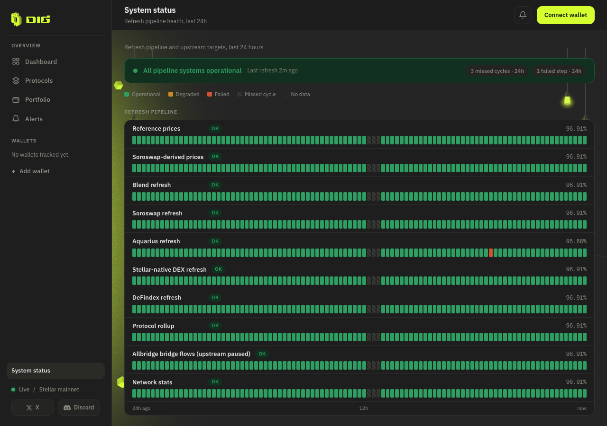
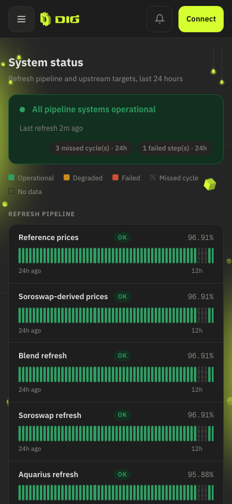
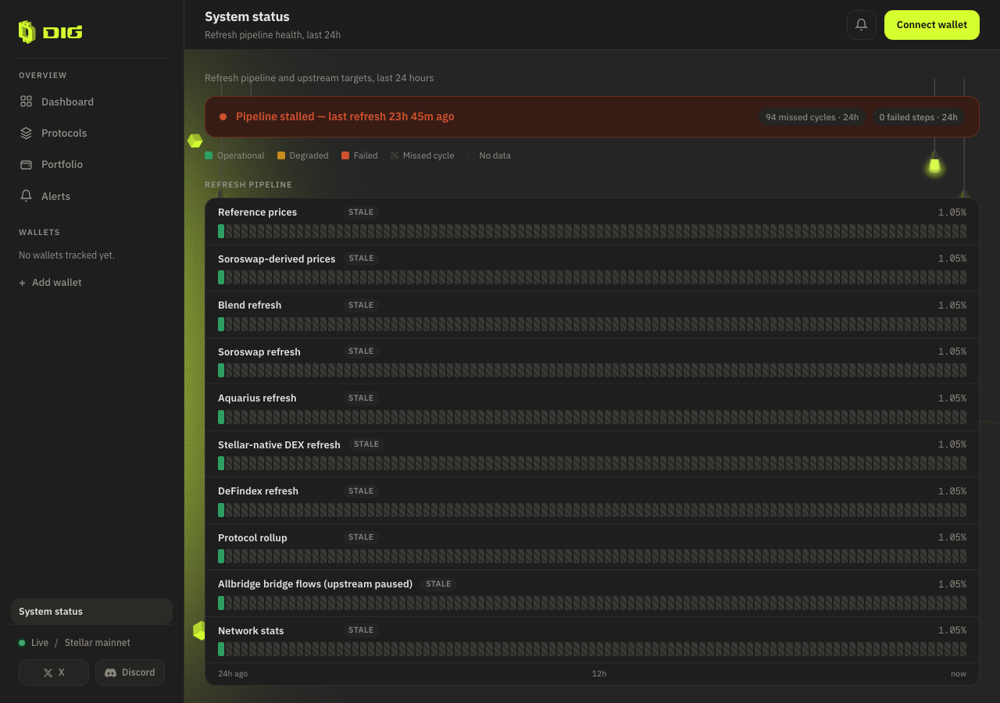
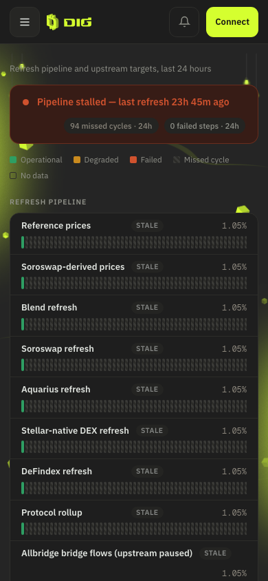

# Lot ST — Status page (`GET /v1/ops/status` + `#status` view): build evidence

**Dates:** 2026-09-03 → 2026-09-05 · **Framing:** post-grant upgrade (Sept 2026), builds on
Lot E (T3-D3 observability). No SCF criterion involved — this is the visible face of the
already-validated observability, never "uptime monitoring".
**Recon:** `00-recon-2026-09-03.md` (incl. the resolved stale-cache anomaly).
**Commits:** stage 1 `204ca89` (api) · stage 2 `457d3d1` (web) · stage 2b `3911cd9` (gap fix).

---

## Stage 1 — API endpoint + steps-query fix (`204ca89`)

New pure aggregation `apps/api/src/modules/ops/status.ts` (`computeOpsStatus()` +
`OPS_STATUS_RULES` + labels maps), served by `GET /v1/ops/status` in the existing ops module.

**Live local payload** (jq summary; the sparse numbers are the honest 2-run local DB of that
moment — 6.8h apart = 26 missed cycles under the pre-2b between-runs-only rule):

```json
{
  "overall": { "state": "degraded", "lastRunAt": "2026-09-03T16:10:33.854Z",
               "missedCycles24h": 26, "failedSteps24h": 0 },
  "gaps": [ { "after": "2026-09-03T09:19:16.504Z", "before": "2026-09-03T16:10:33.854Z",
              "missedCycles": 26 } ],
  "historySince": "2026-08-13T08:43:59.238Z",
  "n": 2,
  "comps": "14 components (10 steps + 4 rpc), all labels resolved, availability 0.0714"
}
```

**`Cache-Control: no-store`** (same regime as faucet eligibility):

```
HTTP/1.1 200 OK
Cache-Control: no-store
Content-Type: application/json; charset=utf-8
```

**400 on any other window:**

```json
{"message":"Unsupported window '7d'. Supported: 24h","error":"Bad Request","statusCode":400}
```

**The `/v1/ops/metrics` steps-query fix** — before the fix the steps block returned the
latest row EVER per step (recon §A.2: `window: "24h"` was untrue for `steps[].last*`):

```diff
       from refresh_step_runs r
+      where run_at >= now() - interval '${WINDOW_INTERVAL}'
       order by step asc, run_at desc
```

Verified live: `[.steps[].lastRunAt] | unique` → exactly one recent timestamp.

**Tests:** the ops module had none. Suite went **129 → 147** across the three stages
(12 aggregation fixtures + 2 controller window-guard tests in stage 1, +1 in 1b, +3 in 2b),
`jest` 14 suites green, `nest build` clean. Baseline note: the pre-ST count was 129 (per
`docs/evidence/lot-ac/ac4-close-out.md`), not the 125 quoted in the brief.

Stage 1b (same api commit series): `overall.state` corrected to the CURRENT state — derived
from the latest run + trailing age only (unknown / outage / degraded / operational); history
lives in the bars and the 24h counters. RPC failures never flip `overall` (pipeline banner
stays ours; upstream health is per-component).

## Stage 2 — Web view (`457d3d1`)

`#status` view registered in the hash-based `useView` (public, no wallet gating), "System
status" link at the bottom of the sidebar nav (plain link, no live dot for the beta),
`useOpsStatus` composable (fetch on enter + 60 s poll while mounted, F4
loading/error/empty/ready states, reads ONLY `/v1/ops/status`), `StatusBar` segmented bar
(SEVERITY_STYLE colours, hatched gap tiles, outlined empty slots, native title/aria tooltips,
keyboard-focusable), `FreshnessChip` → click-through to `#status` on all call sites. The
Allbridge row suffix "(upstream paused)" reuses the bridge banner's condition via the shared
`isBridgeUpstreamPaused()` extracted into `useBridge` — one source of truth.

**Local capture fixture** (throwaway — never committed; run against the local DB only).
Marker: `run_at` seconds exactly `:33`; real writer rows carry sub-second precision
(`…:33.854`), so the cleanup predicate cannot touch them. SQL verbatim:

```sql
-- Seed: 96 synthetic runs over the last 24h into BOTH tables; one FAILED aquarius
-- step at n=20 (≈−5h), runs n∈{44,45,46} omitted (≈−11h, a 3-cycle gap),
-- price-sources at 10% errors for n∈4..11 (≈−1h..−3h, degraded not failed).
with runs as (
  select
    date_trunc('minute', now()) - interval '2 minutes'
      + interval '33 seconds'
      - (n * interval '15 minutes') as run_at,
    n
  from generate_series(0, 95) n
  where n not in (44, 45, 46)
)
insert into refresh_step_runs (run_at, step, status, duration_ms, message)
select
  r.run_at,
  s.step,
  case when s.step = 'aquarius' and r.n = 20 then 'FAILED' else 'SUCCESS' end,
  1500 + (r.n % 7) * 210,
  case when s.step = 'aquarius' and r.n = 20
       then 'fixture: simulated pool refresh failure' else null end
from runs r
cross join (values
  ('prices:reference'), ('prices:soroswap-derived'), ('blend'), ('soroswap'),
  ('aquarius'), ('stellar-native'), ('defindex'), ('protocol-metrics'),
  ('allbridge'), ('network-stats')
) s(step)
on conflict (run_at, step) do nothing;

with runs as (
  select
    date_trunc('minute', now()) - interval '2 minutes'
      + interval '33 seconds'
      - (n * interval '15 minutes') as run_at,
    n
  from generate_series(0, 95) n
  where n not in (44, 45, 46)
)
insert into rpc_metrics_runs (run_at, target, calls, errors, p50_ms, p95_ms, p99_ms)
select
  r.run_at,
  t.target,
  100,
  case when t.target = 'price-sources' and r.n between 4 and 11 then 10 else 0 end,
  90 + (r.n % 5) * 12,
  260 + (r.n % 5) * 30,
  420 + (r.n % 5) * 45
from runs r
cross join (values
  ('soroban-rpc'), ('horizon'), ('defindex-api'), ('price-sources')
) t(target)
on conflict (run_at, target) do nothing;

-- Cleanup:
delete from refresh_step_runs where extract(second from run_at) = 33;
delete from rpc_metrics_runs  where extract(second from run_at) = 33;
```

**Row counts** (every cycle, identical): steps **120 → 1050 → 120**, rpc **48 → 420 → 48**;
real rows' `max(run_at)` (`2026-09-03 16:10:33.854+00`) intact after every cleanup.

**Captures** (final build, `captures/`): fixture at 1280 and 390 — banner operational +
"3 missed cycles · 24h" / "1 failed step · 24h", the red aquarius tile, the 3-cycle hatched
gap, the amber price-sources span.


 **Body horizontal overflow measured 0 px at both widths, zero
console errors** (both asserted by the capture script on every run); tiles ≥ 4 px at 390 with
the bar scrolling in its own container (Lot AA rule). Web `vue-tsc` build green, 111 vitest
green.

## Stage 2b — trailing/leading gaps (`3911cd9`)

**The stalled-render bug:** with gaps computed only BETWEEN consecutive runs, a pipeline dead
for 23h read as banner "Pipeline stalled — last refresh 23h 45m ago" while the counters said
"0 missed cycles" and every row showed **100.00 %** availability with one green tile and empty
space. A dead pipeline must not read 100 %.

*Before* captures: `status-1280-cleaned.png` / `status-390-cleaned.png` **at commit
`457d3d1`** (`docs/evidence/status-page/captures/` in that tree — replaced in the current tree,
binaries not re-added). *After* captures (this tree): same DB state now renders **`outage`, "94 missed cycles · 24h",
availability 1.05 %**, and each bar shows 1 green + ~94 hatched tiles — tile position ≈ time
position.




**Fix:** the window is a time axis; gap candidates are the spans between consecutive events in
`[windowStart, run₁…runₙ, now]`. The trailing span is always a real gap once overdue
(`before: null`, `missedCycles = floor(span/cadence)` — the next run is late, so the first
cycle counts once overdue by the 1.75 factor); the leading span counts only when
`historySince ≤ windowStart`, otherwise the payload carries `noDataBefore` (fresh deploy =
"no data", never fake grey history). Both flow into `missedCycles24h` and every availability
denominator.

**New tests (2b):**
- `stalled pipeline (one run 23h28m ago, old history) → outage, open-ended trailing gap, ~1% availability`
- `fresh deploy (history starts 2h ago, 8 runs) → no leading gap, noDataBefore set, availability 1`
- `a late-but-not-stale pipeline (35m since last run) → trailing gap of 2, overall still operational`

Density pass in the same stage: rows ~115 px → ~60 px, axis rendered once per group, counters
pluralised, in-page h1 dropped (the topbar owns the title, matching every other view).

## Judgement calls (recorded for review)

1. **14 px tile max-width** — without it, a single run's tile stretched across the full bar
   and read as "24h all green"; the cap keeps sparse history visually honest while 96 tiles
   still fill the row.
2. **RPC failures never flip `overall`** — the banner reflects OUR pipeline (cadence + step
   outcomes); a flaky upstream provider stays visible per-component. Founder-confirmed.
3. **`overall.state` = current state** (founder correction, stage 1b) — latest run + trailing
   age only; history stays in `gaps[]`, the 24h counters, and the bars.
4. **Leading gap is conditional on pre-window history** — a fresh deploy shows "no data",
   never invented missed cycles (`noDataBefore`).
